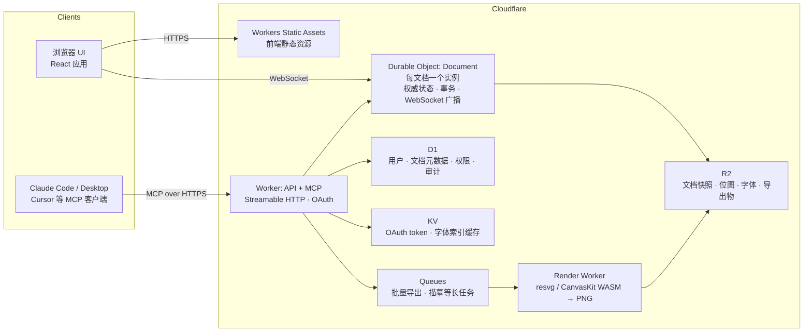
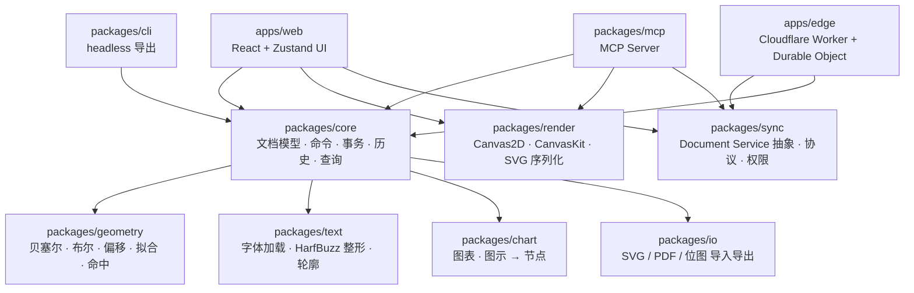

# Zibel — MCP 驱动的 Web 矢量绘图工具 需求文档

| 项目 | 内容 |
|---|---|
| 文档版本 | v0.4（草案） |
| 日期 | 2026-09-22 |
| 状态 | 待评审；v0.4 落实 grilling 前三轮共 28 项决策（含更名 Zibel、MCP 无状态网络化），见 §10.2；术语表见根目录 `CONTEXT.md`，架构决策见 `docs/adr/` |
| 调研依据 | `docs/research/01-illustrator-core-features.md`（Illustrator 功能盘点）、`02-web-vector-tech-landscape.md`（Web 矢量技术与竞品）、`03-mcp-design-tool-patterns.md`（MCP 设计工具接口模式） |

> 本文档中出现的 Illustrator 工具、面板、菜单名保留英文原名；本项目自身的模块、工具（MCP tool）名使用 `snake_case` 英文。"Agent" 指通过 MCP 调用本系统的 AI 客户端（Claude Code、Claude Desktop、Cursor 等）。

---

## 目录

1. 项目概述
2. 调研结论摘要
3. 目标用户与使用场景
4. 产品原则与设计约束
5. 功能需求
   - 5.1 文档模型
   - 5.2 画布、视图与导航
   - 5.3 选择
   - 5.4 绘图工具
   - 5.5 路径编辑
   - 5.6 布尔运算与形状构建
   - 5.7 变换、对齐与吸附
   - 5.8 外观：填充、描边、渐变、透明度、外观栈
   - 5.9 文字
   - 5.10 遮罩
   - 5.11 符号、重复、混合等实时对象
   - 5.12 图层面板与对象管理
   - 5.13 图表模块
   - 5.14 插画模块
   - 5.15 自由手绘模块
   - 5.16 导入与导出
   - 5.17 历史、撤销与版本
   - 5.18 人机协作
6. MCP 接口需求
7. 非功能需求
8. 技术架构建议
9. 里程碑与范围划分
10. 风险与开放问题
- 附录 A：Illustrator 功能映射表
- 附录 B：场景图 JSON Schema 草案
- 附录 C：术语表

---

## 1. 项目概述

### 1.1 一句话定位

**Zibel 是一个运行在浏览器里的专业矢量绘图工具，文档模型从第一天起就是为 AI Agent 通过 MCP 读写而设计的，同时给人类用户提供接近 Adobe Illustrator 核心体验的画布与面板。**

### 1.1.1 产品名：Zibel

- **含义**：Zibel 是德语 Zobel、法语 zibeline（貂）的短拼。貂毫（Kolinsky sable）是插画与水彩领域最顶级的画笔毛料，寓意"最好的笔"。中文读作"齐贝尔"。
- **形式**：5 个字母的自造词。CLI `zibel`，npm 包名 `zibel` 与 scope `@zibel/*`，URI scheme `zibel://`，MCP 工具前缀 `zibel_`。
- **核查**（`docs/research/05-name-conflict-check.md`，2026-09-23）：npm、PyPI、crates.io 均空闲，`zibel.dev` 与 `zibel.app` 未注册，GitHub 无同名项目。商标未查，发布前需手工检索 USPTO / EUIPO / WIPO。
- **为何不用 Sable**：原名 Sable 的包名与短域名全部被占，且 Sable AI 在同一开发者 / Agent 受众中已有品牌。
- **备选**：Kolinsky（全部空闲，但属艺术材料通用词，商标有描述性风险）、Zibeline。
- 仓库：`github.com/286486/zibel`（由 `sable` 更名，旧地址自动重定向）。

### 1.2 要解决的问题

| 现状 | 问题 |
|---|---|
| Illustrator 是桌面软件，脚本接口（ExtendScript）老旧，官方 MCP（Beta 30.4+）只做分析和批量导出，不能从零生成矢量 | Agent 无法用 Illustrator 级别的能力"画图" |
| Figma / Penpot / Canva 有官方 MCP，但它们是 UI 设计 / 模板工具：布尔运算不稳定、没有可变宽度描边、没有图表工具、没有专业级路径编辑 | 适合排版界面，不适合插画、信息图、手绘 |
| Excalidraw / tldraw 有优秀的 agent 集成，但只是白板：无真正贝塞尔编辑、无布尔、无排版引擎 | 产出物是草图，不是可交付的矢量作品 |
| 图表 MCP（antvis、Vega-Lite）输出 PNG 或不可编辑 SVG | 图表生成后人无法继续在同一工具里精修 |

Zibel 要填的空位是：**Agent 能生成、人能精修、二者共享同一份可编辑矢量文档**。

### 1.3 目标

1. **复刻 Illustrator 核心功能**：覆盖调研报告一 §6 中第一梯队 14 项与第二梯队的大部分（详见附录 A）。
2. **三大场景可交付**：图表 / 信息图、插画 / 图标 / Logo、自由手绘 / 速写。
3. **MCP 优先**：每一个人能在 UI 里完成的编辑，Agent 都能通过 MCP 完成，且能拿到视觉与结构两种反馈。
4. **人机同一文档**：人类在浏览器中打开的文档与 Agent 正在编辑的文档是同一份实时状态，变更双向可见。
5. **开放格式**：原生文件为可读 JSON，SVG 无损往返，PDF 导出。
6. **开源**：全部代码以 Apache-2.0 发布（见 §8.4），任何人可自托管；官方托管版跑在 Cloudflare 上。
7. **托管即服务**：官方托管版基于 Cloudflare（Workers、Durable Objects、R2、D1），全球边缘低延迟，文档在边缘节点上权威存储与同步。

### 1.4 非目标（明确排除）

- 印刷生产工作流：ICC 色彩管理、专色、叠印、陷印、出血与裁切标记。（参照 Illustrator 保留 **CMYK 文档模式的数值与近似预览**，列为 P2；不承诺印刷准确性。）
- 3D and Materials、Perspective Grid、Gradient Mesh、Liquify 七件套、Puppet Warp。
- `.ai` 私有格式的高保真读写（只做 PDF 兼容层的基本导入）。
- 栅格图像编辑（只做置入、裁切、描摹）。
- 原生桌面客户端（第一阶段只做 Web，PWA 可离线是加分项）。
- 非 Cloudflare 的官方托管形态（自托管用户运行同一 Worker 包于 workerd，见 §6.2）。
- stdio 传输与任何有状态 MCP 会话（见 §6.1 原则 11）。

### 1.5 成功指标（V1 验收）

| 指标 | 目标 |
|---|---|
| Illustrator 第一梯队功能覆盖 | 14/14 |
| Agent 端到端任务成功率（内部 30 个基准任务：柱状图、流程图、图标、Logo、手绘转矢量等） | ≥ 80% 一次通过，≥ 95% 两轮反馈内通过 |
| 画布性能 | 10,000 个路径节点下平移缩放 ≥ 55 fps |
| MCP 单次简单工具调用延迟（本地） | p95 < 200 ms |
| SVG 往返 | 导入官方 SVG 测试集再导出，视觉 diff < 1% 像素 |

---

## 2. 调研结论摘要

三份调研报告的详细内容见 `docs/research/`。对需求有直接影响的结论如下。

### 2.1 来自 Illustrator 功能盘点（报告一）

- Illustrator 官方把工具分为 Draw / Select / Navigate / Paint / Text / Modify 六类；教程（Classroom in a Book、LinkedIn Learning、User Guide）高度一致地把 **14 项**列为入门必学：工作区与画板、选择、基本形状与 Live Shapes、Pen 与贝塞尔编辑、Shape Builder 与 Pathfinder、变换、对齐、填充与描边、颜色与 Recolor、图层、文字、渐变、剪切蒙版、导出。这是 MVP 范围的直接依据。
- **Compound Shape（非破坏性布尔）与 Compound Path（挖洞）是两个不同概念**，Illustrator 用 Pathfinder 面板同时承载，需求上必须分别建模。
- **Appearance 面板**允许一个对象有多重 fill / stroke 与效果栈，并可施加在 object / group / layer 任一层级。这是 Illustrator 区别于 Figma 类工具的核心差异，也是"插画"场景的关键能力。
- Illustrator 的脚本 DOM（`Document → Layer → PageItem → PathItem.pathPoints`，每个 PageItem 有 `uuid`、`geometricBounds` / `visibleBounds`）已经是一套成熟的"给程序用"的抽象，本项目的场景图与 MCP 工具命名直接向其对齐。
- Graph 工具在教程里属进阶，但对本项目是核心；Live Paint 有大量功能限制，建议不复刻，用"闭合区域填充"替代。

### 2.2 来自 Web 矢量技术与竞品（报告二）

- **SVG DOM 撑不住专业级大文档**：Penpot 社区案例 168 个节点拖拽即冻结 3–6 秒；Figma 与 Penpot 都独立走向自研 GPU / WASM 渲染。结论：渲染后端必须与文档模型解耦、可插拔，MVP 用 Canvas2D，V2 升级 CanvasKit（Skia WASM）或 WebGL。
- **布尔运算**是精度陷阱。Paper.js 在近重合点上有长期未修 bug；**Skia PathOps（经 CanvasKit）**是公认最稳健的曲线级方案；Clipper2 适合折线级。
- **文字**：只有"HarfBuzz 整形 → 字形轮廓"这条路能同时满足复杂文种正确性与逐字形可编辑（Illustrator / Figma / InDesign 的做法）。
- **手绘**：perfect-freehand（tldraw、Excalidraw 采用）+ fit-curve 拟合贝塞尔是成熟组合。
- 四个成功产品（Figma、Penpot、tldraw、Excalidraw）都收敛到**扁平、以 ID 为键的记录存储**，父子关系以数据编码而非嵌套对象图；Figma 用 parent 属性 + 分数索引排序。这是 Agent 友好文档模型的形态。
- **图表转可编辑矢量**：D3 / Vega-Lite 产出 SVG → 解析为原生节点，是可行且有先例（RAWGraphs 即为此定位）的路径。
- 许可注意：tldraw 2025 年 9 月起商用需付费；potrace 是 GPL，商业闭源应选 imagetracerjs（Unlicense）。

### 2.3 来自 MCP 设计工具接口模式（报告三）

- 四种接口粒度各有代价：细粒度 CRUD（token 贵、往返多）、声明式批量 JSON（ID 管理是关键）、脚本执行（一次调用做多步，但需沙箱）、DSL 入 / 矢量出（图表、图示最优）。**结论：混合**——高频结构化操作用批量声明式工具，图表用"每类型一工具 + 共享 schema"（antvis 模式），复杂排版留一个沙箱化脚本工具（Figma `use_figma` 模式，绝不做 Blender 式裸 `exec`）。
- 反馈回路必须同时有"给人看的图"（PNG）和"给模型继续操作的结构"（ID 列表、稀疏大纲、SVG 文本）。Figma `get_metadata` 的稀疏 XML 与 Excalidraw `describe_scene` 是范例。
- 事务：Canva 的 `start / perform / commit editing transaction` 三段式解决了 Agent 多步操作在人类撤销栈里碎成几十步的问题。
- 常见坑：颜色格式（0–1 vs 0–255）、隐式"当前页 / 当前选区"状态导致多 Agent 竞态、大文档 token 膨胀、脚本工具安全边界。需求上要求：单一 canonical 颜色格式、所有寻址显式传 ID、分层读取 API、脚本工具沙箱化并标注 `destructiveHint`。
- MCP 规范提供的 `outputSchema` / `structuredContent`、image content、resource_link、工具 annotations、分页、progress 都应使用；resources/subscribe 与 elicitation 依赖有状态会话，本项目不用（见 §6.1 原则 11）。

---

## 3. 目标用户与使用场景

### 3.1 用户画像

| 用户 | 描述 | 主要诉求 |
|---|---|---|
| **P1 AI Agent** | Claude Code / Claude Desktop / Cursor 等 MCP 客户端中的模型，代表人类执行绘图任务 | 工具少而高层、schema 清晰、每步有回执与视觉反馈、错误可修正 |
| **P2 设计师 / 插画师** | 熟悉 Illustrator，希望在浏览器里获得相近的手感 | 钢笔手感、快捷键一致、布尔与外观栈可靠、导出可交付 |
| **P3 知识工作者 / 开发者** | 需要做图表、架构图、流程图、幻灯片配图；愿意用自然语言让 Agent 起稿再手工微调 | 从数据 / 描述到图，一分钟内出可编辑结果 |
| **P4 开发者（集成方）** | 想把 Zibel 嵌入自己的产品或流水线，headless 生成 SVG / PNG | 无 UI 运行、稳定 API、可自托管 |

### 3.2 三大场景

**场景 A：图表 / 信息图**
- 输入：表格数据（CSV / JSON）、自然语言描述、Mermaid 文本。
- 产出：柱状 / 条形 / 堆叠 / 折线 / 面积 / 散点 / 饼 / 环 / 雷达图，流程图 / 架构图 / 组织结构图，且**每个元素都是普通矢量对象**，可继续被人或 Agent 编辑。
- 关键能力：图表对象保留数据绑定（改数据自动重绘），"展开"后失去绑定成为纯路径；主题与调色板；文字自动排版避让。

**场景 B：插画 / 图标 / Logo**
- 输入：草图、参考图、文字描述。
- 产出：干净的闭合路径、合理的图层结构、可复用符号、渐变与外观栈。
- 关键能力：钢笔与曲率工具、布尔与 Shape Builder、多重填充 / 描边、渐变（线性 / 径向 / 自由）、剪切蒙版、Recolor、Image Trace、画笔。

**场景 C：自由手绘 / 速写**
- 输入：鼠标、触控笔（压力、倾斜）、手指；或 Agent 给出的点序列。
- 产出：平滑的可编辑贝塞尔路径（而非位图笔迹）、可选自动识别为规整形状（Shaper）。
- 关键能力：低延迟笔迹渲染、压感变宽、平滑 / 简化、Blob Brush 式填充笔、擦除、手绘转规整形状。

### 3.3 代表性用户故事

- **US-01（P3 + P1）**："把这份季度销售 CSV 画成堆叠柱状图，用公司蓝色系，把 Q3 那根柱子标红并加注释。" Agent 调 `chart_create_stacked_column`，再 `node_update` 改色并 `node_create` 加文字，最后 `render` 截图确认无重叠。
- **US-02（P2）**：设计师用钢笔画 Logo 轮廓，按 Shift+M 用 Shape Builder 合并，在 Appearance 面板加第二层描边做外发光效果，导出 SVG 与 PDF。
- **US-03（P1 + P2）**：Agent 根据描述生成一版图标草稿（20 个图标，24×24 网格），设计师逐个手工微调锚点，Agent 随后按设计师的修改统一批处理"所有描边改为 1.5px"。
- **US-04（P2 / P3）**：用 iPad 触控笔手绘一张流程草图，Shaper 把潦草矩形和箭头识别为规整形状，Agent 再把手写文字替换为文字对象并对齐。
- **US-05（P4）**：CI 流水线中 headless 调用 MCP：读取架构 YAML，生成架构图 SVG 提交到仓库。
- **US-06（P1）**：Agent 打开一份已有插画，用 `doc_outline` 看结构、`scene_describe` 拿摘要，再局部 `render` 某个组，找到"太阳"对象并把渐变从黄改成橙。

---

## 4. 产品原则与设计约束

1. **文档模型即 API。** 人类 UI 与 MCP 工具都只是对同一套命令（Command）的两种前端。任何 UI 能做的编辑，必须有对应命令，命令即可暴露为 MCP 工具或脚本 API。
2. **扁平场景图、显式 ID。** 所有节点在一个以稳定 ID 为键的表中，父子与顺序是数据字段。工具调用绝不依赖"当前选区 / 当前图层 / 当前画板"这类隐式状态；选区只是 UI 的便利，Agent 需要时显式传 ID 列表。
3. **非破坏性优先。** 布尔（Compound Shape）、重复、混合、效果、图表数据绑定默认保持"实时"，用户显式 `expand` 才固化。
4. **单一规范格式。** 坐标以画布左上为原点、y 向下、单位 pt（1/72 in，CSS px 与 pt 1:1）；颜色统一为 `#RRGGBB` / `#RRGGBBAA`（在 schema 里显式声明，不接受 0–1 浮点 RGB）；路径数据统一为 SVG `d` 语法（绝对坐标、只含 M/L/C/Q/Z）。
5. **每次写操作返回回执。** 至少包含 `createdIds`、`updatedIds`、`deletedIds`、受影响节点的 bounds，以及可选的缩略图。
6. **分层读取。** 大纲（稀疏）→ 节点详情（按 ID）→ 完整导出，三级都有，Agent 按需下钻，不让整份文档进上下文。
7. **事务 = 撤销单元。** Agent 的多步操作在事务里提交，人类按一次 Ctrl+Z 撤销整个事务。
8. **人机并发安全。** 服务端权威、按属性最后写入胜出（Figma 模型），节点级软锁；不追求离线 CRDT。
9. **视觉反馈是一等公民。** 渲染快照是 MCP image content，可指定范围、缩放、是否显示辅助线（bounds、锚点、ID 标签）。
10. **快捷键与 Illustrator 默认键位一致**（V/A/P/M/L/T/G/Shift+M 等），降低 P2 迁移成本；冲突处以 Illustrator 为准。

---

## 5. 功能需求

需求编号规则：`F-<模块>-<序号>`。优先级：**P0** = MVP 必须，**P1** = V1 必须，**P2** = V2。每条需求后括号内为优先级。

### 5.1 文档模型

对齐 Illustrator 脚本 DOM（`Document → Artboard / Layer → PageItem`），但采用 Figma / tldraw 式扁平存储。

**F-DOC-01 文档（Document）**（P0）
- 属性：`id`、`name`、`version`（schema 版本）、`rev`（单调递增的文档修订号，每个提交的 Transaction 加一）、`units`（pt，固定）、`colorSpace`（sRGB，固定）、`createdAt / updatedAt`、`assets`（资源库）、`nodes`（节点表）、`artboards`、`rootOrder`（顶层图层顺序）。
- 一个文档可包含 1–1000 个画板（与 Illustrator 上限一致）。
- 原生文件格式 `.zibel.json`：UTF-8 JSON，可读、可 diff、可 git 管理。内嵌位图以 base64 或相对路径引用（可选）。

**F-DOC-02 节点（Node）通用属性**（P0）
- `id`（稳定，ULID）、`type`、`name`、`parentId`、`index`（分数索引字符串，用于排序）、`visible`、`locked`、`opacity`（0–1）、`blendMode`（16 种，与 Illustrator 一致）、`transform`（2×3 仿射矩阵）、`tags`（字符串数组）、`meta`（任意 JSON，供 Agent 存备注 / 数据绑定）。
- 只读派生属性：`geometricBounds`（不含描边）、`visibleBounds`（含描边与效果）、`worldTransform`。

**F-DOC-03 节点类型**（P0 除标注外）
| type | 说明 | 对应 Illustrator |
|---|---|---|
| `layer` | 图层容器；有 `color`（选中高亮色）、`isTemplate`。**父级只能是文档根或另一个 `layer`**；`doc_outline` 顶层永远是 Layer 列表 | Layer / Sublayer |
| `group` | 编组；可出现在 `layer` 或 `group` 内，**不能包含 `layer`** | GroupItem |
| `path` | 贝塞尔路径，`d`（SVG 语法）、`closed`、`fillRule`（nonzero / evenodd） | PathItem |
| `compound_path` | 多个子路径共同填充（挖洞） | CompoundPathItem |
| `rect` / `ellipse` / `polygon` / `star` / `line` / `arc` / `spiral` | **Live Shape**：保留参数（圆角半径、边数、内外半径、起止角等），随时可"转为路径" | Live Shapes |
| `text` | 文本框，`kind`：point / area / on_path；`content` 富文本 runs | TextFrameItem |
| `image` | 置入位图，`src`、`crop`、`embedded` | RasterItem / PlacedItem |
| `symbol_instance` | 指向 `assets.symbols[*]`，含实例覆盖 | SymbolItem |
| `compound_shape` | 非破坏性布尔容器（Compound Shape）：`op` + 子节点。术语见 `CONTEXT.md`，不叫 boolean | Compound Shape |
| `clip_group` | 剪切蒙版组：第一个子节点为 clip path | Clipping set |
| `mask_group` | 不透明度蒙版组 | Opacity mask |
| `blend` (P1) | 混合对象：起止子对象 + `steps / spacing / orientation` | Blend |
| `repeat` (P1) | `mode`: radial / grid / mirror + 参数 | Repeat |
| `chart` (P0) | 图表对象：`chartType`、`data`、`encoding`、`theme`；子节点是生成的普通矢量节点（只读，展开后可编辑） | GraphItem |
| `artboard` | 画板：`frame`、`name`、`background`。**不是节点、不能作父级**，只影响导出范围、对齐基准与 `render` scope | Artboard |

**F-DOC-03a Live Object（实时对象）**（P0）：Live Shape、`compound_shape`、`blend`、`repeat`、`chart`、带 `effects` 的节点、带画笔的描边统称 Live Object。定义：保留参数、由参数派生几何、必须支持 `expand`（固化为 Path，丢参数）；容器型 Live Object 还支持 `release`（恢复子节点）。`node_get detail: full` 对 Live Object 同时返回参数与派生几何。

**F-DOC-04 样式模型**（P0）
- 每个可绘制节点有 `appearance`：`fills[]`、`strokes[]`、`effects[]`，**数组即外观栈**（顺序 = 绘制顺序）。MVP 的 UI 默认只显示 1 fill + 1 stroke，但模型从一开始支持多重。
- `Fill`：`type` solid / gradient / pattern，`color`、`gradientId` 或内联渐变、`opacity`、`blendMode`。
- `Stroke`：`color / gradient`、`width`、`cap`（butt / round / square）、`join`（miter / round / bevel）、`miterLimit`（1–500）、`dash[]`、`dashOffset`、`align`（center / inside / outside）、`arrowStart / arrowEnd`（样式、缩放、对齐）、`widthProfile`（可变宽度点列，P1）、`brushId`（P1）。
- `Gradient`：`type` linear / radial / freeform（P2），`stops[]`（offset、color、midpoint）、`transform`。
- `Effect`（P1）：`type` drop_shadow / inner_glow / outer_glow / blur / offset_path / round_corners / zigzag / transform / outline_stroke，参数 JSON。效果为非破坏性，可 `expand_appearance`。

**F-DOC-05 资源库（Assets）**（P0 除标注外）
- `swatches[]`（颜色、颜色组）、`gradients[]`、`patterns[]`（P1）、`symbols[]`、`graphicStyles[]`（P1，外观预设）、`characterStyles[] / paragraphStyles[]`（P1）、`brushes[]`（P1）、`chartThemes[]`。
- 资源可被节点引用；更新资源定义，所有引用处同步（Illustrator 的 Redefine Symbol / 全局色板语义）。

**F-DOC-06 Schema 版本化与迁移**（P0）：文档带 `version`，加载时按 tldraw 模式跑 `up` 迁移；不支持降级。

### 5.2 画布、视图与导航

- **F-VIEW-01** 无限画布，画板作为导出与对齐边界；平移（Space 拖拽 / 触控板双指）、缩放（Z、Ctrl+滚轮、Ctrl+0 适合窗口、Ctrl+1 100%、Ctrl+Alt+0 显示所有画板）、旋转视图（Shift+H，P2）。（P0）
- **F-VIEW-02** 预览 / 轮廓（Outline）模式切换 Ctrl+Y。（P1）
- **F-VIEW-03** 标尺（Ctrl+R）、网格、参考线（从标尺拖出、路径转参考线）、智能参考线（对齐边缘 / 中心 / 等距 / 角度提示）。（P0：标尺网格参考线；P1：智能参考线）
- **F-VIEW-04** 吸附：吸附到点、到网格、到像素、到参考线；可开关。（P0）
- **F-VIEW-05** 隔离模式（双击进入组 / 符号编辑，面包屑退出）。（P1）
- **F-VIEW-06** 画板管理：新建（预设尺寸 A4 / Letter / 1920×1080 / 社交媒体等）、复制、重排、改名、背景色、自动排列。（P0）
- **F-VIEW-07** 多视口 / 导航器面板。（P2）
- **F-VIEW-08** 性能：10k 节点平移缩放 ≥ 55 fps；视口裁剪；脏矩形或瓦片渲染。（P0 目标，P1 验收）

### 5.3 选择

- **F-SEL-01** Selection（V）：点选、框选、Shift 加选、Alt+Shift 减选；双击进入组。（P0）
- **F-SEL-02** Direct Selection（A）：选锚点、段、手柄；框选锚点。（P0）
- **F-SEL-03** Group Selection：Alt 修饰或独立工具。（P1）
- **F-SEL-04** Lasso（Q）套索选择对象与锚点。（P1）
- **F-SEL-05** Magic Wand（Y）：按填充色 / 描边色 / 描边宽 / 不透明度 / 混合模式 + 容差选择同类对象；菜单 Select > Same > …。（P1）
- **F-SEL-06** Select All / Deselect / Inverse / Select All on Active Artboard / Save Selection（命名选区）。（P0 前三项，P1 后两项）
- **F-SEL-07** Agent 侧对应：`node_query`（按类型 / 名称 / 标签 / 颜色 / 区域），不依赖 UI 选区。（P0）

### 5.4 绘图工具

**基本形状（P0）**
- **F-DRAW-01** Rectangle（M）、Rounded Rectangle、Ellipse（L）、Polygon（3–1000 边）、Star（3–1000 角，内外半径）、Line Segment（\）、Arc、Spiral、Rectangular Grid、Polar Grid。均为 Live Shape，保留参数。拖拽时 Shift 约束比例 / 角度、Alt 从中心、Space 移动、方向键改边数 / 圆角（Illustrator 惯例）。
- **F-DRAW-02** 圆角控件：矩形 / 多边形每个角独立圆角半径与圆角类型（round / inverted round / chamfer）。（P1）
- **F-DRAW-03** 椭圆饼图控件（起止角）。（P1）

**路径绘制（P0）**
- **F-DRAW-04** Pen（P）：点击加角点、拖拽出手柄成平滑点、Alt 拖拽断开手柄、点击已有端点续画、点击起点闭合、悬停路径 ± 增删锚点、Shift 约束 45°。橡皮筋预览。
- **F-DRAW-05** Curvature（Shift+~）：点击生成连续平滑曲线，双击切角点 / 平滑点，拖点实时改曲线。
- **F-DRAW-06** Pencil（N）：徒手路径，Fidelity（0–100）平滑度选项；Alt 拖直线；端点附近续画；Ctrl 闭合。
- **F-DRAW-07** Paintbrush（B）：徒手路径 + 画笔描边（Calligraphic 画笔 P0，其余 P1）。
- **F-DRAW-08** Blob Brush（Shift+B）：徒手生成填充形状，相同外观的笔迹自动合并；Alt 临时 Smooth。（P1）
- **F-DRAW-09** Smooth、Path Eraser、Eraser（Shift+E，按笔迹擦除填充形状）、Scissors（C，在锚点 / 段上剪断）、Knife（P1）、Join 工具（P1）。
- **F-DRAW-10** Shaper（Shift+N）：把潦草手绘识别为矩形 / 椭圆 / 多边形 / 直线 / 箭头（见 5.15）。（P1）
- **F-DRAW-11** 绘图模式：Draw Normal / Draw Behind / Draw Inside（Shift+D）。（P1）
- **F-DRAW-12** 新建对象默认继承当前 fill / stroke（工具面板双色块 + X 切换 + D 默认黑白 + / 无色）。（P0）

### 5.5 路径编辑

- **F-PATH-01** 锚点操作：移动、增删（+ / -）、Anchor Point 工具（Shift+C）角点 ↔ 平滑点转换、拉出 / 收回手柄、Alt 独立拖单侧手柄、多锚点对齐 / 平均（Average：水平 / 垂直 / 两者）。（P0）
- **F-PATH-02** 段操作：拖动段改曲率（Direct Selection 拖段）、段转直线 / 曲线、删除段。（P0）
- **F-PATH-03** `Object > Path` 菜单等价命令：Join（Ctrl+J，端点连接，含跨路径）、Average、Outline Stroke（描边转填充轮廓）、Offset Path（偏移、连接类型、斜接限制）、Simplify（曲线精度、角点阈值、转直线选项，显示前后锚点数）、Add Anchor Points（每段中点加点）、Divide Objects Below、Split Into Grid、Clean Up（删游离点 / 空文字 / 未上色对象）、Reverse Path Direction。（P0：Join / Average / Outline Stroke / Offset / Simplify / Add Anchor / Reverse；P1：其余）
- **F-PATH-04** Width 工具（Shift+W）：在路径任意位置拖出宽度点，形成可变宽度描边；宽度配置文件可存为预设。（P1）
- **F-PATH-05** Reshape 工具、Free Distort。（P2）
- **F-PATH-06** 路径信息：长度、面积、锚点数、方向，显示在 Info 面板与 `measure` 工具。（P0）
- **F-PATH-07** 路径 ↔ Live Shape：Live Shape 任何锚点级编辑自动"转为路径"并提示；`convert_to_path` 显式命令。（P0）

### 5.6 布尔运算与形状构建

- **F-BOOL-01** Shape Modes：Unite / Minus Front / Intersect / Exclude。默认生成非破坏性 `compound_shape` 节点（Illustrator 中的 Alt+点击行为），按 Alt 或选项"Expand"直接固化为路径。（P0）
- **F-BOOL-02** Pathfinders（破坏性）：Divide / Trim / Merge / Crop / Outline / Minus Back。（P0：Divide / Minus Back；P1：其余）
- **F-BOOL-03** `compound_shape` 节点可嵌套、可 Release（还原子对象）、可 Expand；子对象仍可被 Direct Selection 编辑并实时重算。（P0）
- **F-BOOL-04** Compound Path Make / Release（Ctrl+8 / Alt+Shift+Ctrl+8），填充规则可切换 nonzero / evenodd。（P0）
- **F-BOOL-05** Shape Builder（Shift+M）：拖过重叠区域合并，Alt 拖擦除，点击单区域拆分为独立形状；悬停高亮待合并区域；可选"拾取颜色来源"。（P0）
- **F-BOOL-06** 精度要求：使用 Skia PathOps（CanvasKit）或等价鲁棒算法；对近重合点、自相交、共线段有回归测试集；失败时返回可解释错误而非静默产出错误几何。（P0）
- **F-BOOL-07** 闭合区域填充（Live Paint 的先行替代）：点击任意由路径围成的封闭区域（允许缝隙容差）直接生成填充路径。（P1）
- **F-BOOL-08** Live Paint 组（参照 Illustrator）：`live_paint` 实时对象，edge / face 模型，Live Paint Bucket（K）与 Live Paint Selection（Shift+L），Gap Options，路径编辑后颜色自动重分配，Release / Expand。Illustrator 对 Live Paint 组的功能限制（不可 Pathfinder、不可蒙版等）同样适用。（P2）

### 5.7 变换、对齐与吸附

- **F-XFORM-01** 边界框直接变换：移动、缩放（Shift 等比、Alt 中心）、旋转（边界框外拖动或 R 工具）、镜像（O）、倾斜（Shear）。所有变换工具支持 Alt+点击设参考点并打开数值对话框，Alt 拖拽复制。（P0）
- **F-XFORM-02** Transform 面板：9 点参考点、X / Y / W / H、旋转角、倾斜角、锁定比例、Live Shape 参数、Scale Strokes & Effects、Scale Corners、Flip H / V。（P0）
- **F-XFORM-03** Free Transform（E）：自由扭曲 / 透视扭曲手柄。（P1）
- **F-XFORM-04** Transform Each（逐个变换，含随机）、Transform Again（Ctrl+D）。（P1）
- **F-XFORM-05** Align 面板：左 / 中 / 右 / 上 / 中 / 下 对齐；等距分布对象与间距分布；三种基准：Selection / Key Object / Artboard；可对齐锚点。（P0）
- **F-XFORM-06** 排列：Bring to Front / Forward / Backward / Send to Back（Ctrl+Shift+] 等）；跨图层移动。（P0）
- **F-XFORM-07** 智能参考线与吸附：边缘、中心、等距、对齐延长线、角度（45° 倍数）、路径上的点 / 垂直 / 切线（P1）；像素对齐。（P0 基础，P1 全部）
- **F-XFORM-08** 测量工具与 Dimension 标注（线性 / 角度 / 半径，可作为实时对象）。（P2）

### 5.8 外观：填充、描边、渐变、透明度、外观栈

- **F-APP-01** 颜色面板：HEX / RGB / HSB / 灰度输入，色轮 / 色带，取色器（Eyedropper I，可拾取外观 / 仅颜色 / 文字属性）。（P0）
- **F-APP-02** Swatches 面板：文档色板、颜色组、渐变 / 图案色板、全局色（修改即同步所有使用处）、色板库导入导出（ASE、JSON）。（P0，ASE P1）
- **F-APP-03** Stroke 面板：宽度、cap、join、miter limit、对齐描边、虚线（多段 dash / gap、对齐到角点）、箭头（起止样式、缩放、对齐方式）、可变宽度配置文件、画笔定义。（P0；可变宽度与画笔 P1）
- **F-APP-04** Gradient 面板 + 画布上的 Gradient Annotator（G 工具）：线性 / 径向（含椭圆比例与焦点）、色标增删、中点、角度、扭曲；渐变可用于 fill 与 stroke（描边渐变支持沿描边 / 跨描边，P2）。（P0 线性径向填充；P1 描边渐变）
- **F-APP-05** Freeform Gradient（点模式 / 线模式）。（P2）
- **F-APP-06** 图案填充：图案定义（瓦片、间距、偏移排布）、Pattern 编辑模式、图案随对象变换或独立变换。（P1）
- **F-APP-07** Transparency 面板：不透明度、16 种混合模式、隔离混合 / 挖空组（P2）。（P0）
- **F-APP-08** Appearance 面板：多重 fill / stroke，拖拽排序，每层独立不透明度 / 混合模式，效果栈可开关 / 编辑 / 删除；可施加于 object / group / layer；Clear Appearance、Reduce to Basic Appearance、Expand Appearance；"New Art Has Basic Appearance"开关。（P1）
- **F-APP-09** Graphic Styles：把外观栈存为样式，应用、更新（同步所有使用处）、断开链接。（P1）
- **F-APP-10** Effects（矢量、非破坏性）：Drop Shadow、Inner / Outer Glow、Feather、Gaussian Blur、Round Corners、Offset Path、Outline Object / Stroke、Zig Zag、Roughen、Pucker & Bloat、Transform、Warp 系列（Arc、Flag、Fish 等 15 种）。效果渲染为矢量或栅格缓存，导出 SVG 时尽量映射到 SVG filter，否则栅格化。（P1 阴影 / 发光 / 模糊 / 圆角 / 偏移 / 变换；P2 其余）
- **F-APP-11** Recolor Artwork：提取所选对象的颜色，映射到新色板 / 色彩和谐规则 / 限定颜色数 / 随机打乱顺序 / 调饱和度亮度；Agent 用 `recolor` 传映射表。（P1）
- **F-APP-12** Color Guide（和谐规则：互补、三色、类似色等生成候选色板）。（P2）

### 5.9 文字

- **F-TEXT-01** 三种文本对象：Point Type（T 点击）、Area Type（T 拖框或点击闭合路径内）、Type on a Path（点击路径）；纵排（P2）。（P0 点 / 区域；P1 路径文字）
- **F-TEXT-02** 字符属性：字体族 / 样式（系统字体 + Google Fonts + 上传 TTF / OTF / WOFF2）、字号、行距、字距（kerning：metrics / optical / 手动）、字符间距（tracking）、水平 / 垂直缩放、基线偏移、旋转、大小写、上下标、下划线 / 删除线、颜色（fill / stroke 独立）。（P0 常用项；P1 全部）
- **F-TEXT-03** 段落属性：左 / 中 / 右 / 两端对齐、缩进、段前后距、连字符（P2）、制表符（P2）。（P0 对齐缩进）
- **F-TEXT-04** 区域文字：自动换行、溢出标记、串接文本框（threading，P2）、行列分栏（P2）、Auto Size。（P0 基础）
- **F-TEXT-05** 路径文字：沿路径起止滑块、翻转、对齐基线 / 上 / 下 / 中、效果（Rainbow / Skew / 3D Ribbon / Stair / Gravity，P2）。（P1）
- **F-TEXT-06** Create Outlines（Shift+Ctrl+O）：文字转曲为 compound_path 组，逐字形可编辑。（P0）
- **F-TEXT-07** OpenType 特性：连字、替代字形、数字样式、样式集；Glyphs 面板。（P2）
- **F-TEXT-08** 字符 / 段落样式。（P1）
- **F-TEXT-09** 整形引擎：使用 HarfBuzz（WASM）做整形与字形定位，保证 CJK、阿拉伯语、天城文正确；渲染与导出用同一套字形轮廓，保证 WYSIWYG。（P0）
- **F-TEXT-10** 文本绕排（Text Wrap）。（P2）
- **F-TEXT-11** 字体缺失处理：提示替换、记录原字体名、导出时可选转曲或嵌入子集。（P0）

### 5.10 遮罩

- **F-MASK-01** 剪切蒙版（Ctrl+7 / Alt+Ctrl+7）：任意矢量对象（含文字、compound path）作为 clip path；建立时 clip path 的 fill / stroke 清空（与 Illustrator 一致），但可在 Appearance 中重新赋予；隔离模式编辑内容；Release。（P0）
- **F-MASK-02** 不透明度蒙版：蒙版对象亮度决定透明度（白显黑隐）；Clip / Invert / Link 开关；Transparency 面板缩略图切换编辑目标。（P1）
- **F-MASK-03** Draw Inside 模式自动生成剪切组。（P1）

### 5.11 符号、重复、混合等实时对象

- **F-LIVE-01** Symbols：定义、放置实例、实例覆盖（颜色 / 变换 / 文字，P1）、Redefine（全局同步）、Break Link、Replace、Select All Instances、符号库导入导出。（P1）
- **F-LIVE-02** Repeat：Radial（数量、半径、角度范围）、Grid（行列、间距、镜像翻转）、Mirror（轴角度）；原对象改动实时更新；Release / Expand。（P1）
- **F-LIVE-03** Blend（W）：指定步数 / 指定距离 / 平滑颜色；对齐页面 / 路径；替换 / 反转轴；Release / Expand。（P1）
- **F-LIVE-04** Envelope Distort：Make with Warp（15 种预设）/ Mesh / Top Object；编辑内容 / 释放 / 扩展。（P2）
- **F-LIVE-05** 通用 `expand`：一次性把任意 Live Object（Live Shape、compound_shape、blend、repeat、chart、效果、描边、渐变→路径组）固化为普通路径。（P0 对 P0 类型；随类型推进）

### 5.12 图层面板与对象管理

- **F-LAYER-01** Layers 面板：树形展示图层 / 子图层 / 组 / 对象；缩略图；显示 / 隐藏、锁定、图层颜色；拖拽重排与重新父级；点击右侧圆点选中（target）对象；Alt 点击选中图层全部内容；搜索与按类型过滤。（P0）
- **F-LAYER-02** 图层操作：新建、复制、合并、拼合、Release to Layers（Sequence / Build）、Collect in New Layer、Paste Remembers Layers。（P0 前四项；P1 其余）
- **F-LAYER-03** 对象命名与自动命名（`<Path>`、`<Group>`、图表 / 文字自动取内容）；Agent 写入的名称与 `tags` 显示在面板。（P0）
- **F-LAYER-04** 模板图层（锁定、半透明显示参考图）。（P1）
- **F-LAYER-05** Global Edit：按外观 / 尺寸匹配相似对象后批量编辑。Agent 侧用 `node_query` + `node_update` 实现，UI 提供入口。（P2）

### 5.13 图表模块

目标：Illustrator 9 种 Graph 的能力 + 现代图表工具（Datawrapper / Vega-Lite）的声明式便利，产物是普通矢量节点。

- **F-CHART-01** 图表类型（P0，与 Illustrator 9 种 Graph 一一对应）：column、stacked_column、bar、stacked_bar、line、area、scatter、pie、radar；（P1）：donut、stacked_area、bubble、histogram、box_plot、heatmap、treemap、waterfall、funnel、gauge；（P2）sankey。
- **F-CHART-02** 数据输入：内联 JSON 行、CSV 文本、粘贴表格（UI 里有 Graph Data 表格编辑器，支持 Tab / Enter 导航、转置、切换 x/y）、从 URL 加载（P2）。数字解析忽略千分位、支持百分号与货币符号。（P0）
- **F-CHART-03** 编码（encoding）：x / y / series / size / color 字段映射；数值 / 分类 / 时间轴类型；轴范围、刻度数、格式（d3-format / d3-time-format 语法）、网格线、轴标题；图例位置；数据标签（位置、格式）；排序；空值处理。（P0 主要项）
- **F-CHART-04** 主题（chartTheme 资源）：调色板（分类 / 顺序 / 发散）、字体、描边宽度、背景、间距；内置 4–6 套；Agent 可传主题对象。默认调色板需满足 WCAG 对比与色盲友好。（P0）
- **F-CHART-05** 图表对象（`chart` 节点）保留数据绑定：更新 `data` / `encoding` / `theme` 重新生成子节点，同时**保留用户对子节点的手工覆盖**（按稳定的语义 key 匹配：`series=Q3,category=East`）；无法匹配的覆盖丢弃并提示。（P1；P0 允许"重新生成即覆盖手工改动"并明确提示）
- **F-CHART-06** Expand Chart：断开绑定，子节点成为普通路径 / 文字，可任意编辑。（P0）
- **F-CHART-07** 组合图表：同一坐标系叠加 column + line；双 y 轴。（P1）
- **F-CHART-08** 图形标记设计（Graph Design 等价）：用任意符号替换柱 / 点（重复 / 拉伸 / 滑动缩放）。（P2）
- **F-CHART-09** 图示（diagram）：接受 Mermaid（flowchart、sequence、class、state、ER、gantt 子集）或结构化 JSON（节点 + 边 + 布局提示）生成流程图 / 架构图 / 组织结构图；自动布局（dagre / ELK）；生成物为 `group`，含节点形状、连接线（带箭头的 `path`，有 `meta.edge` 绑定）、文字；连接线在移动节点时保持连接（connector 绑定，P1）。（P0 Mermaid flowchart + JSON；P1 其他类型与实时连接）
- **F-CHART-10** 布局智能：标签避让（数据标签重叠时自动偏移或隐藏）、长文字自动换行、图例自动换行。（P1）
- **F-CHART-11** 导出：图表节点导出 SVG 时保留 `data-*` 属性（系列 / 类别 / 值），便于下游脚本。（P1）

### 5.14 插画模块

在 5.4–5.11 的基础上，插画场景额外需要：

- **F-ILL-01** 画笔系统：Calligraphic（角度、圆度、直径，可绑定压力）P0；Art Brush（沿路径拉伸一段图稿，可分段缩放）P1；Scatter Brush P1；Pattern Brush（边 / 角瓦片）P2；Bristle P2。画笔描边为非破坏性，可 Expand 为路径。（见括注）
- **F-ILL-02** Image Trace：置入位图 → 预设（自动色 / 高色 / 低色 / 灰度 / 黑白 / 轮廓线）→ 参数（颜色数、阈值、路径拟合度、角点、噪点、方法 abutting / overlapping、忽略白色）→ 预览 → Expand 为路径组。实现采用 imagetracerjs（Unlicense）或自研，不使用 GPL 的 potrace。（P1）
- **F-ILL-03** Recolor Artwork（见 F-APP-11）。（P1）
- **F-ILL-04** 参考图工作流：置入图像为模板图层，设不透明度，锁定；Agent 可以 `image_place` + 描摹。（P0）
- **F-ILL-05** 对称绘制（Mirror Repeat 的实时版，画一半自动镜像）。（P1，随 Repeat）
- **F-ILL-06** 图标网格与像素对齐：24 / 16 网格预设、Snap to Pixel、整数描边宽度检查（validate 工具报告）。（P0）
- **F-ILL-07** 导出资产：Asset Export（收集对象为资产，多倍率 PNG / SVG 一次导出）。（P1）

### 5.15 自由手绘模块

- **F-FREE-01** 输入：Pointer Events 统一处理鼠标 / 触控笔 / 手指；读取 `pressure`、`tiltX / tiltY`、`twist`；Palm rejection（触控时忽略手掌，可配置只接受笔）；`getCoalescedEvents` 获取高频采样点。（P0）
- **F-FREE-02** 实时笔迹：绘制中用 perfect-freehand 风格的即时轮廓渲染（延迟 < 16 ms）；抬笔后拟合为贝塞尔路径（fit-curve，误差可调）并按需简化。（P0）
- **F-FREE-03** 笔类型：Pencil（细线路径，宽度固定）、Paintbrush + 压感 Calligraphic 画笔（宽度随压力）、Blob Brush（填充形状，笔迹自动合并）、Eraser（按笔迹擦除填充）。（P0 Pencil / Paintbrush；P1 Blob / Eraser）
- **F-FREE-04** 平滑参数：Fidelity（精确 ↔ 平滑，与 Illustrator Pencil / Paintbrush 选项一致）、"Keep selected" 与 "Edit selected paths"（在端点附近续画）。稳定器（延迟跟随、抖动抑制）Illustrator 没有，列为 P2 增强。（P0 Fidelity）
- **F-FREE-05** Shaper 识别：单笔潦草矩形 / 圆 / 三角 / 多边形 / 直线 / 箭头 → 规整 Live Shape；两形状重叠涂抹合并 / 擦除（Shape Builder 手势）。（P1）
- **F-FREE-06** Agent 侧：`freehand_stroke` 接受点序列（含可选压力）走同一条平滑 / 拟合管线，让 Agent 能"手绘"（例如生成手写风格线条或有机形状）。（P0）
- **F-FREE-07** 手绘风格渲染选项（Excalidraw 式 rough 风格）作为一种 Effect，可开关。（P2）
- **F-FREE-08** 触控设备 UI：大按钮工具条、双指缩放平移、三指撤销、长按上下文菜单。（P1）

### 5.16 导入与导出

**导入**
- **F-IO-01** SVG 1.1 导入（P0）：`path / rect / circle / ellipse / line / polyline / polygon / text / tspan / textPath / g / use / symbol / defs / linearGradient / radialGradient / pattern / clipPath / mask / image`，`transform`、`style` 与 presentation attributes、`viewBox`；不支持的元素（filter、foreignObject、animate）保留为原始 XML 片段并提示。SVG `<text>` 尽力映射到文本对象，字体缺失按 F-TEXT-11 处理。
- **F-IO-02** 位图置入 PNG / JPG / WebP / GIF（首帧）；链接或嵌入；裁切。（P0）
- **F-IO-03** PDF 导入（第一页或指定页；矢量路径与文字尽力提取，不保证图层）；`.ai`（PDF 兼容模式保存的文件）按 PDF 处理。（P2）
- **F-IO-04** 粘贴：剪贴板 SVG 文本、Figma / Illustrator 复制出来的 SVG、位图。（P0 SVG 与位图）
- **F-IO-05** 原生 `.zibel.json` 打开与拖入。（P0）

**导出**
- **F-IO-06** SVG 导出（P0）：范围（文档 / 画板 / 选中对象）、精度（小数位 1–7）、样式写法（presentation attributes / inline style / `<style>` 类）、文字处理（保留 `<text>` / 转曲 / 嵌入字体子集 P1）、是否包含 `id` 与 `data-*`、是否压缩（SVGO）、是否响应式（去 width/height 留 viewBox）。实时对象展开导出；效果映射到 SVG filter 或栅格化。
- **F-IO-07** PNG / JPG / WebP 导出：范围、倍率（1x / 2x / 3x / 自定义 DPI）、背景透明 / 颜色、裁切到画板或到对象 bounds 加边距。（P0）
- **F-IO-08** PDF 导出：矢量保留、字体嵌入、多画板多页。（P1）
- **F-IO-09** Export for Screens 式批量导出：多画板 × 多格式 × 多倍率一次导出为 zip。（P1）
- **F-IO-10** 复制为 SVG / 复制为 PNG 到剪贴板；复制 CSS（渐变 / 颜色）。（P0 前两项）
- **F-IO-11** EPS、DXF：不做（非目标）。

### 5.17 历史、撤销与版本

- **F-HIST-01** 无限撤销 / 重做（内存上限可配，默认 200 步），基于可逆命令（delta）；历史面板可跳转到任一步。（P0）
- **F-HIST-02** 事务：UI 一次拖拽 = 一个事务；Agent 通过 `tx_begin / tx_commit` 包裹多步为一个撤销单元。事务状态存于文档（Durable Object）而非连接，`txId` 由每个写工具显式传入；5 分钟无活动自动回滚（可配）。（P0）
- **F-HIST-03** 命名快照：手动或 Agent 创建快照，可对比与恢复。（P1）
- **F-HIST-04** 自动保存：本地 IndexedDB 每 5 秒增量保存；崩溃恢复。（P0）
- **F-HIST-05** 版本历史（服务器端，按时间点恢复）。（P2）

### 5.18 人机协作

- **F-COLLAB-01** 同一文档同时被浏览器 UI 与一个或多个 Agent 编辑：所有变更经文档服务广播，UI 实时看到 Agent 的修改（带来源标识与高亮闪烁），Agent 通过 `doc_changes(sinceRev)` 拉取变更摘要（MCP 层无推送）。（P0）
- **F-COLLAB-02** 冲突策略：服务端权威，按属性最后写入胜出；对结构性操作（删除父节点 vs 子节点被编辑）定义确定性规则（删除胜出，编辑方收到 `NODE_GONE`）。（P0）
- **F-COLLAB-03** 节点软锁：UI 用户正在拖拽的对象对 Agent 返回 `LOCKED_BY_USER`；Agent 事务中的节点在 UI 显示"Agent 正在编辑"并禁止拖拽（可强制解锁）。（P1）
- **F-COLLAB-04** Agent 光标 / 意图展示：UI 显示 Agent 当前正在操作的区域与一行说明（来自工具调用的 `intent` 字段）。（P1）
- **F-COLLAB-05** 多人协作（多浏览器用户）：光标、选区、评论。（P2）
- **F-COLLAB-06** 权限：文档级 owner / editor / viewer；每个 Agent Actor 凭自己的 token 获得 editor 或 viewer；`run_script` 需要额外授权标志。（P1）
- **F-COLLAB-07** Actor：每次修改都记录其 Actor（人类 User，或一个 Agent 凭证）。每个 MCP 客户端授权时获得独立 token，一个 token 即一个 Agent Actor，历史中显示为"Claude Code（woody）"；人类可按 Actor 撤销或回看修改。（P0）

---

## 6. MCP 接口需求

### 6.1 设计原则

依据报告三 §A–D 的对比与 Anthropic「Writing effective tools for agents」指南：

1. **混合粒度**：约 55 个具名工具（含 9 个 P0 图表工具），统一前缀 `zibel_`，按"名词_动词"命名并分组；大多数写工具接受**数组**（批量）；图表每类型一个工具族共享 schema；保留一个沙箱化 `run_script` 作为逃生舱。
2. **显式寻址**：所有工具都要 `docId`；节点操作要 `nodeIds`。没有"当前文档 / 当前选区 / 当前图层"的隐式参数。UI 选区可通过 `selection_get` 读到，但只是便利。
3. **回执标准化**：所有写工具返回统一 `WriteReceipt`（见 6.5）。
4. **分层读取**：`doc_outline`（稀疏）→ `node_get`（详情）→ `export`（全量）。默认返回 `concise`，可选 `detailed`。
5. **视觉反馈内建**：`render` 返回 MCP image content；写工具可选 `returnPreview: true` 附带受影响区域缩略图。
6. **事务即撤销单元**：`tx_begin / tx_commit / tx_rollback`。
7. **工具 annotations 全部声明**：`readOnlyHint`、`destructiveHint`、`idempotentHint`、`openWorldHint`（本服务全部为 false，除 `image_place` 从 URL 拉图时）。
8. **`outputSchema` + `structuredContent`**：每个工具声明输出 schema，客户端可程序化消费。
9. **错误即修正提示**：错误消息包含 `code`、`message`、`hint`（下一步该做什么）、`path`（schema 中出错字段），不返回堆栈。
10. **Skill 文档随服务分发**：`skill://zibel/*` 资源提供绘图约定、坐标 / 颜色规范、推荐工作流（骨架优先 → 填充 → 校验），客户端按需加载，不塞进工具描述。
11. **MCP 层无状态**：只用 Streamable HTTP，不发 `Mcp-Session-Id`；每个请求自带 Bearer token 与全部寻址信息（`docId`、`txId`），任意 Worker 实例都能处理，请求之间 MCP 服务端不留任何状态。文档的权威状态（含未提交事务、锁、修订号）全部在该文档的 Durable Object 里。因此：无 stdio、无 `resources/subscribe`、无 elicitation、无服务端发起的请求；进度通知只在单个请求的 SSE 响应流内发送。见 ADR-0006。

### 6.2 Server 形态与部署

只有一种运行形态：**同一个 Worker 包**。官方托管跑在 Cloudflare；本地开发用 `wrangler dev`（本地 workerd，`http://localhost:8787/mcp`）；自托管用 workerd 的 Docker 镜像。三者行为一致。



- **F-MCP-01 传输**：仅无状态 Streamable HTTP。托管地址 `https://mcp.<domain>/mcp`，OAuth 2.1 授权（MCP authorization 规范），**首发仅 GitHub 作为身份提供方**，每个 MCP 客户端一个 token（即一个 Agent Actor）。本地 `wrangler dev` 默认关闭鉴权或使用固定开发 token。M0 即走 HTTP（localhost），M1 上线托管与 OAuth。（P0）
- **F-MCP-02 Headless 渲染**：`render` / `export` 在 Node 端或 Worker 端用 resvg-wasm（SVG → PNG，小体积，P0）完成；需要与浏览器像素一致的效果（混合模式、效果栈）时用 CanvasKit WASM（P1）。渲染输入统一是 core 的 SVG 序列化结果，保证三端一致。（P0）
- **F-MCP-03 UI 附着**：浏览器经 WebSocket 连接 Document DO 实时看到变更；Agent 的每次工具调用由无状态 Worker 转发到同一个 DO；`render` 可选 `source: "ui" | "headless"`。（P0）
- **F-MCP-04 多文档**：每个文档一个 Durable Object，天然隔离与水平扩展；本地 `wrangler dev` 同样如此。（P0）
- **F-MCP-05 无会话**：不存在 MCP 会话。事务以 `txId` 标识、存于 DO、5 分钟无活动超时回滚；软锁挂在 `txId` 上随事务释放；变更感知用 `rev` + `doc_changes` 拉取，写工具可带 `ifRev` 做乐观并发检查。（P0）
- **F-MCP-06 打包与部署**：`wrangler dev` 本地运行；`wrangler deploy` 一键部署官方托管栈（Worker + DO + R2 + D1 迁移脚本）；workerd Docker 镜像供非 Cloudflare 自托管。Claude Code / Claude Desktop / Cursor 的 HTTP MCP 配置示例。开发阶段 Cloudflare Free 档足够（本地 workerd 无 CPU 限制），**M1 托管上线第一周切 Workers Paid（$5/月）**，因 Free 档 CPU 10 ms 跑不了 headless 渲染。（P0）
- **F-MCP-06a Cloudflare 资源映射**（P0 设计，M1 落地）：

| 需求 | Cloudflare 资源 | 说明 |
|---|---|---|
| 权威文档状态、事务日志、WebSocket 广播 | **Durable Objects**（每文档一个，SQLite 存储后端） | 单实例串行化解决并发；WebSocket Hibernation 降低空闲成本；事务日志写 DO SQLite，定期快照到 R2 |
| MCP Streamable HTTP、REST API、OAuth | **Workers** | 无状态；把工具调用转发到对应文档 DO |
| 前端静态资源 | **Workers Static Assets**（或 Pages） | 全球 CDN |
| 文档快照、位图、上传字体、导出文件 | **R2** | S3 兼容，无出站流量费；导出物用预签名 URL 作为 `resource_link` |
| 用户、文档索引、权限、审计日志、分享链接 | **D1** | 关系型元数据 |
| OAuth token、Google Fonts 索引缓存、渲染缓存 | **KV** | 最终一致即可的数据 |
| 批量导出、Image Trace、PDF 生成等长任务 | **Queues** + Worker consumer | 配合 MCP progress token / `job_status` |
| Headless PNG 渲染 | Worker 内 **resvg-wasm**；复杂效果走 **Browser Rendering**（headless Chromium）作为回退 | 已核实（`docs/research/04-cloudflare-limits.md`）：脚本上限 64 MiB 未压缩、内存 128 MB、Free 档 CPU 仅 10 ms → 渲染必须在 **Workers Paid（$5/月）** 上跑；Browser Rendering 每月仅含 10 小时，只能做回退 |
| `run_script` 沙箱 | DO 内 **QuickJS WASM**；后续可评估 Cloudflare **Dynamic Workers / Worker Loaders** 做真隔离 | 见 F-MCP-07 |
| 登录 | **GitHub OAuth 经 Worker 实现**（Google 放 M3）；企业版可接 Cloudflare Access | MCP 客户端走同一 OAuth 授权服务器 |
| 观测 | Workers Analytics Engine / Logpush | 工具调用日志（F-NFR 可观测性） |

- **F-MCP-06b 数据驻留与限制**（已按 `docs/research/04-cloudflare-limits.md` 核实）：单 DO SQLite 上限 10 GB（Paid）远超需求，但**单键值上限 2 MB**，因此文档不能整块存一个键：事务日志按行写 SQLite，节点表按节点或分片存储，完整快照写 R2；单文档 JSON 建议 < 50 MB，位图一律外置 R2；同一文档 ≤ 50 个活跃连接为设计目标。（P0 设计约束）

- **F-MCP-06c 托管首发形态**：M1 托管版为**免费 beta + 硬配额**，不做计费；计费与付费档推到 M3。超限返回 `LIMIT_EXCEEDED` 并提示。（P0）

| 配额（每用户） | 值 |
|---|---|
| 文档数 | 50 |
| R2 存储（位图、字体、导出物、快照） | 200 MB |
| 每日 `render` | 500 次 |
| 每日 `export` | 200 次 |
| 单文档 JSON | 20 MB |
| 单次上传位图 | 5 MB |
| 同一文档并发浏览器连接 | 20 |

- **F-MCP-06d 域名**：注册于 Cloudflare Registrar（`zibel.dev` 为首选）；M1 前用 `wizard` 生成一份手动配置向导，覆盖 Cloudflare 账号、域名、GitHub OAuth App。（P0）

### 6.3 Resources（资源）

| URI 模板 | 内容 | 用途 |
|---|---|---|
| `zibel://docs` | 打开的文档列表（JSON） | 发现 |
| `zibel://docs/{docId}/outline?depth=&filter=` | 稀疏大纲（id、type、name、bounds、childCount），Figma `get_metadata` 式 | 低 token 概览 |
| `zibel://docs/{docId}/nodes/{nodeId}` | 单节点完整 JSON | 精读 |
| `zibel://docs/{docId}/render.png?scope=&scale=` | 渲染快照 | 视觉反馈 |
| `zibel://docs/{docId}/export.svg?scope=` | SVG 文本 | 可被模型读取并推理 |
| `zibel://docs/{docId}/assets` | 色板 / 渐变 / 符号 / 主题清单 | 复用资源 |
| `zibel://docs/{docId}/history?limit=` | 最近事务列表（who / when / summary / ids） | 了解人类做了什么 |
| `skill://zibel/drawing-conventions` | 坐标、单位、颜色、path `d` 规范、命名建议 | 首次使用必读 |
| `skill://zibel/workflows` | 图表 / 插画 / 手绘的推荐调用序列与校验清单 | 任务指南 |
| `skill://zibel/chart-recipes` | 每种图表的示例输入与典型错误 | 图表 |
| `skill://zibel/script-api` | `run_script` 可用的 Editor API 参考 | 脚本 |

资源列表与模板列表支持 cursor 分页。不提供 `resources/subscribe`：变更用 `doc_changes` 拉取。

### 6.4 工具清单

标注：R = readOnlyHint，D = destructiveHint，I = idempotentHint。未标 D 的写工具为追加式（不覆盖已有内容）。所有写工具接受可选 `txId`（在事务内）、`ifRev`（文档修订号不等于该值时拒绝写入，返回 `REV_CONFLICT`）与 `intent`（一句话说明，显示给 UI 用户）。

#### 6.4.1 文档与变更

| 工具 | 输入要点 | 输出 | 注 |
|---|---|---|---|
| `doc_list` | — | 文档摘要列表 | R |
| `doc_create` | `name`, `artboards[]`（预设名或 w/h）, `template?` | `docId`, 大纲 | |
| `doc_open` | `path` 或 `docId` 或 `url` | 大纲 | |
| `doc_save` | `docId`, `path?` | 保存位置 | I |
| `doc_close` | `docId`, `discardChanges?` | — | D |
| `doc_get_info` | `docId` | 名称、画板、节点计数、资源计数、当前 `rev`、在线浏览器连接数 | R |
| `doc_changes` | `docId`, `sinceRev`, `limit?` | 该修订号之后已提交的事务摘要：`{rev, txId, actor, summary, createdIds, updatedIds, deletedIds}`，以及当前 `rev` | R |

#### 6.4.2 读取与查询

| 工具 | 输入要点 | 输出 | 注 |
|---|---|---|---|
| `doc_outline` | `docId`, `rootId?`, `depth`（默认 2）, `types[]?`, `includeBounds` | 稀疏树（id / type / name / bounds / childCount / locked / visible） | R |
| `node_get` | `docId`, `nodeIds[]`, `detail: concise|full`, `includeChildren?` | 节点 JSON 数组；`full` 含 `d`、外观栈、文字 runs | R |
| `node_query` | `docId`, 过滤：`types`, `nameRegex`, `tags`, `withinRect`, `intersectsRect`, `fillColor`, `strokeColor`, `hasText`, `artboardId`, `parentId`；`limit`, `cursor` | 匹配节点摘要 + `nextCursor` | R |
| `scene_describe` | `docId`, `scope`（doc / artboard / nodeIds）, `verbosity` | 自然语言场景摘要（对象数、主要颜色、布局分布、文字内容、可疑问题） | R |
| `render` | `docId`, `scope`（doc / artboardId / nodeIds / rect）, `scale`（默认 1，上限 4）, `maxSize`（像素，默认 1600）, `background`, `overlays[]`（bounds / anchors / ids / grid / artboards）, `format`（png / jpeg / svg） | image content（PNG/JPEG）或 SVG 文本 + 元数据（像素尺寸、映射到文档坐标的变换，便于 Agent 把截图坐标换算回文档坐标） | R |
| `hit_test` | `docId`, `point` 或 `rect`, `mode`（top / all / anchors） | 命中节点 id 列表（按 z 序）、锚点索引 | R |
| `measure` | `docId`, `nodeIds[]` 或 `points[]` | bounds、中心、面积、路径长度、两点距离与角度、两个节点的间距 | R |
| `selection_get` / `selection_set` | `docId`, `nodeIds[]` | 当前 UI 选区 | R / 写 |
| `validate` | `docId`, `scope`, `rules[]?` | 问题列表：开放路径、零面积对象、超出画板、文字溢出、重叠文字、非整数描边、未使用资源、极小对象、缺失字体 | R |

#### 6.4.3 创建

| 工具 | 输入要点 | 输出 | 注 |
|---|---|---|---|
| `node_create` | `docId`, `nodes[]`：每项含 `type`、`parentId`（**必填**，某个 `layer` 或 `group` 的 id；`doc_create` 的回执含默认图层 id，Agent 永远有可用父级；不接受 artboardId）、`index?`、类型专属几何（rect: x/y/w/h/radius；ellipse；polygon；star；line；path: `d`；text: content/kind/box；image: src；group: children[] 内联嵌套）、`appearance`、`name`、`tags`、`meta` | `WriteReceipt`（含每个输入项对应的新 id，顺序一致） | 批量，一次可建数百节点 |
| `svg_import` | `docId`, `svg`（文本）, `parentId`, `position?`, `fit?` | 生成节点树的回执与大纲 | |
| `image_place` | `docId`, `src`（data URL / http URL / 本地路径）, `parentId`, `frame?`, `embed`, `asTemplate?` | 回执 | openWorldHint 若为 URL |
| `freehand_stroke` | `docId`, `parentId`, `points[]`（x, y, pressure?）, `tool`（pencil / brush / blob）, `fidelity`, `width`, `appearance` | 生成路径回执 | |
| `text_create` | 归入 `node_create` type=text；此处保留别名，便于发现 | | |

#### 6.4.4 编辑

| 工具 | 输入要点 | 输出 | 注 |
|---|---|---|---|
| `node_update` | `docId`, `updates[]`：`{nodeId, patch}`，patch 为 JSON Merge Patch（RFC 7396）作用于节点可写属性（name、visible、locked、opacity、blendMode、appearance、几何参数、text 属性、meta） | 回执 | D（覆盖属性） |
| `node_delete` | `docId`, `nodeIds[]` | 回执 | D |
| `node_duplicate` | `docId`, `nodeIds[]`, `offset?`, `count?`, `targetParentId?` | 新 id 映射 | |
| `node_reparent` | `docId`, `moves[]`：`{nodeId, parentId, index | before | after}` | 回执 | |
| `node_reorder` | `docId`, `nodeIds[]`, `op`: front / forward / backward / back | 回执 | |
| `node_transform` | `docId`, `nodeIds[]`, `translate?`, `rotate?`（角度）, `scale?`, `skew?`, `matrix?`, `pivot`（center / 9 点 / 坐标）, `each`（逐个 vs 整体）, `scaleStrokes` | 回执 + 新 bounds | |
| `node_resize` | `docId`, `nodeIds[]`, `width?`, `height?`, `anchor`, `keepAspect` | 回执 | |
| `align_distribute` | `docId`, `nodeIds[]`, `align?`（left/hcenter/right/top/vcenter/bottom）, `distribute?`（horizontal/vertical, spacing?）, `relativeTo`（selection / keyNodeId / artboardId） | 回执 | |
| `group` / `ungroup` | `docId`, `nodeIds[]` / `groupIds[]` | 回执 | |
| `path_edit` | `docId`, `nodeId`, `ops[]`：`move_anchor`、`set_handles`、`set_point_type`、`add_anchor(at t)`、`remove_anchor`、`close`、`open`、`reverse`、`set_d`（整体替换） | 回执 + 新 `d` | D |
| `path_boolean` | `docId`, `nodeIds[]`, `op`（unite / subtract / intersect / exclude / divide / trim / merge / crop / outline / minus_back）, `live`（默认 true → `compound_shape` 节点；false → 直接固化） | 回执 | D（false 时删除源） |
| `path_op` | `docId`, `nodeIds[]`, `op` + 参数：`offset{distance, join, miterLimit}`、`simplify{tolerance, cornerAngle, toLines}`、`outline_stroke`、`join{tolerance}`、`average{axis}`、`add_anchors`、`smooth{amount}`、`split_into_grid{rows, cols, gutter}`、`convert_to_path`、`expand`、`expand_appearance` | 回执 | D |
| `shape_build` | `docId`, `nodeIds[]`, `regions[]`（点或区域选择）, `mode`: merge / erase | 回执 | Shape Builder 的程序化形式 |
| `mask_make` / `mask_release` | `docId`, `clipNodeId`, `contentIds[]`, `kind`: clip / opacity, `invert?` | 回执 | |
| `text_edit` | `docId`, `nodeId`, `content?`（纯文本或 runs）, `range?`, `charStyle?`, `paraStyle?`, `fit?`（auto_width / auto_height / fixed） | 回执 + 溢出信息 | D |
| `text_to_outlines` | `docId`, `nodeIds[]` | 回执 | D |
| `asset_create` / `asset_update` / `asset_delete` / `asset_list` | `docId`, `kind`（swatch / gradient / pattern / symbol / graphic_style / char_style / para_style / brush / chart_theme）, 定义 | 回执 / 列表 | 更新会同步引用处 |
| `symbol_place` | `docId`, `symbolId`, `instances[]`（位置 / 变换 / 覆盖） | 回执 | |
| `live_make` | `docId`, `kind`: blend / repeat / envelope, `nodeIds[]`, 参数 | 回执 | P1 |
| `recolor` | `docId`, `nodeIds[]`, `mapping[]`（from → to）或 `palette[]` + `strategy`（by_luminance / by_hue / preserve_order）, `includeStrokes` | 回执 + 实际映射 | D |
| `image_trace` | `docId`, `imageNodeId`, `preset` 或参数, `expand` | 回执 | P1 |

#### 6.4.5 图表与图示

参照 Illustrator 的 9 个独立 Graph 工具与 antvis/mcp-server-chart 的实践，**每种图表类型一个具名工具**，共享 `ChartDataSchema` / `EncodingSchema` / `ThemeSchema` / `ChartOptionsSchema` 子 schema；更新与展开对所有类型通用。

| 工具 | 输入要点 | 输出 | 注 |
|---|---|---|---|
| `chart_create_column` / `chart_create_stacked_column` / `chart_create_bar` / `chart_create_stacked_bar` / `chart_create_line` / `chart_create_area` / `chart_create_scatter` / `chart_create_pie` / `chart_create_radar` | `docId`, `parentId`, `data`（rows 或 csv）, `encoding`, `frame{x,y,w,h}`, `theme?`（id 或内联）, `options`（axes, legend, labels, sort, stacking） | 回执 + 图表节点 id + 子节点大纲 + 警告（如标签被隐藏） | P0；与 Illustrator 9 种 Graph 一一对应 |
| `chart_create_donut` / `chart_create_stacked_area` / `chart_create_bubble` / `chart_create_histogram` / `chart_create_box_plot` / `chart_create_heatmap` / `chart_create_treemap` / `chart_create_waterfall` / `chart_create_funnel` / `chart_create_gauge` | 同上，类型专属 options | 同上 | P1；`chart_create_sankey` P2 |
| `chart_update` | `docId`, `chartId`, `data? / encoding? / theme? / options?`（merge）；可传 `chartType` 切换类型（Illustrator Graph Type 等价） | 回执 + 保留 / 丢弃的手工覆盖数 | D |
| `chart_expand` | `docId`, `chartId` | 回执 | D（断开绑定） |
| `chart_design_apply` | `docId`, `chartId`, `symbolId`, `mode`（repeat / stretch / sliding） | 回执 | P2，Graph Design 等价 |
| `diagram_create` | `docId`, `parentId`, `source`: `{mermaid}` 或 `{nodes[], edges[], layout}`, `frame?`, `theme?`, `direction` | 回执 + 节点 / 边的 id 与语义 key 映射 | |
| `diagram_layout` | `docId`, `groupId`, `algorithm`（dagre / elk / force）, `direction`, `spacing` | 回执 | D |
| `connector_create` | `docId`, `fromNodeId`, `toNodeId`, `fromSide?`, `toSide?`, `routing`（straight / orthogonal / curved）, `arrow`, `label?` | 回执 | 实时连接 P1 |

工具总数因此增加约 15 个（P0 阶段 9 个）。若评测显示工具数过多影响选择准确率，退路是保留具名工具但在 `tools/list` 中按客户端能力做分组披露。

#### 6.4.6 事务、历史与快照

| 工具 | 输入要点 | 输出 | 注 |
|---|---|---|---|
| `tx_begin` | `docId`, `label?` | `txId`（5 分钟无活动回滚；`timeoutSec` 暂缓，见 ADR-0008） | |
| `tx_commit` | `docId`, `txId` | 汇总回执（全部受影响 id） | |
| `tx_rollback` | `docId`, `txId` | — | D |
| `history_list` | `docId`, `limit` | 事务列表（含来源 user / agent） | R |
| `history_undo` / `history_redo` | `docId`, `steps?` | 回执 | D |
| `snapshot_save` / `snapshot_restore` / `snapshot_list` | `docId`, `name` | — | restore 为 D |

#### 6.4.7 导出

| 工具 | 输入要点 | 输出 | 注 |
|---|---|---|---|
| `export` | `docId`, `format`（svg / png / jpeg / webp / pdf / zibel_json）, `scope`, `options`（见 F-IO-06/07/08）, `destination`（inline / path / resource） | inline 时返回文本或 image content；path 时返回文件路径；resource 时返回 `resource_link` | R |
| `export_batch` | `docId`, `jobs[]` | zip 路径或多个 resource_link；长任务用 progress token 汇报 | R |

#### 6.4.8 脚本

| 工具 | 输入要点 | 输出 | 注 |
|---|---|---|---|
| `run_script` | `docId`, `code`（JavaScript / TypeScript），`timeoutMs`（默认 5000，上限 30000）, `dryRun?` | 脚本 `return` 值（要求为 `{createdIds, updatedIds, deletedIds, result?}`）+ 控制台输出 + 自动汇总的回执 | D；调用方 token 需拥有 `script` 权限。**M1 仅在本地 `wrangler dev` 开放，官方托管 M2 开放** |

- **F-MCP-07** 脚本沙箱：在 QuickJS（WASM）或 isolated-vm 中执行，只暴露 Editor API（与 MCP 工具同源的命令集 + 只读查询 + 几何数学库），无 `fetch`、无文件系统、无 `eval` 宿主；CPU 与内存配额；脚本内所有写操作自动包进一个事务，异常则整体回滚。（P1）
- **F-MCP-08** Editor API 文档以 `skill://zibel/script-api` 与 TypeScript `.d.ts` 资源提供，Agent 可先读类型再写脚本。（P1）

### 6.5 Schema 规范

**坐标与单位**
- 文档坐标：原点画布左上，x 向右，y 向下，单位 pt，`number`（float64）。所有工具输入输出都用**文档坐标**，不使用画板局部坐标；画板信息通过 `artboards[].frame` 提供，Agent 需要时自行加偏移（`skill` 中给出换算示例）。
- 角度：度，顺时针为正。
- 变换矩阵：`[a, b, c, d, e, f]`（SVG 语义）。

**颜色**
- 唯一格式：`"#RRGGBB"` 或 `"#RRGGBBAA"`（大小写不敏感）。schema 用 `pattern` 校验；接收到 `rgb(...)` / 0–1 浮点 / 命名色时返回 `INVALID_COLOR` 与转换提示。渐变 / 图案通过 `{type: "gradient", ...}` 对象表达。

**路径**
- `d` 字符串：绝对坐标，允许 `M L C Q Z`（导入时把 `H V S T A` 与相对命令归一化）；小数最多 3 位。
- `path_edit` 中锚点用 `{index, anchor:[x,y], handleIn:[x,y]|null, handleOut:[x,y]|null, type: corner|smooth}` 表达。

**ID**
- ULID 字符串；由服务生成；`node_create` 允许客户端提供 `clientKey` 以便在回执中对应。

**WriteReceipt（统一回执）**
```json
{
  "txId": "…",
  "rev": 42,
  "createdIds": ["…"],
  "updatedIds": ["…"],
  "deletedIds": ["…"],
  "keyMap": {"clientKey": "nodeId"},
  "bounds": {"x":0,"y":0,"width":0,"height":0},
  "warnings": [{"code":"TEXT_OVERFLOW","nodeId":"…","message":"…"}],
  "failed": [{"index":0,"code":"…","message":"…","hint":"…","path":"…"}],
  "preview": {"type":"image","mimeType":"image/png","data":"…"}
}
```
`failed` 仅在调用带 `partial: true` 时出现：每个未生效项的下标与错误；已生效项照常列在 id 列表中，合为一个 Transaction。

**文本 runs**
- `content: [{text, style:{fontFamily, fontStyle, fontSize, fill, letterSpacing, ...}}]`；段落属性在节点级 `paragraphs[]`。纯字符串输入自动转为单 run。

**分页与大小限制**
- 列表类工具默认 `limit` 100，最大 1000，`cursor` 续页。
- 单次 `node_create` 上限 2000 节点；`svg_import` 上限 5 MB；`render` 单边 ≤ 4096 px。
- 超限返回 `LIMIT_EXCEEDED` 与建议拆分方式。

### 6.6 反馈回路

- **F-MCP-09** 每个写工具支持 `returnPreview: true | {scale, padding}`，返回受影响区域 PNG。（P0）
- **F-MCP-10** `render` 的 `overlays` 可叠加：节点 bounds 与 ID 标签（便于 Agent 把看到的东西与 id 对上）、锚点与手柄、画板边界、网格、标尺刻度。（P0）
- **F-MCP-11** `render` 返回 `viewport` 元数据：`{docRect, pixelSize, scale}`，Agent 可把像素坐标换算为文档坐标再 `hit_test`。（P0）
- **F-MCP-12** `scene_describe` 输出结构化 + 自然语言两段，包括"可疑问题"（文字溢出、对象重叠、超出画板、颜色过多）。（P1）
- **F-MCP-13** `validate` 规则可扩展；推荐工作流在 skill 中写明"每完成一个逻辑阶段调用 `render` + `validate`"。（P0）
- **F-MCP-14** 变更感知：人类的编辑以摘要形式（`{rev, txId, actor, summary:"moved 3 nodes", ids}`）出现在 `doc_changes` 中；skill 文档要求 Agent 在一轮写入前先拉一次，并对关键写入带 `ifRev`。（P0）

### 6.7 错误处理、并发与长任务

- **F-MCP-15** 错误码枚举：`REV_CONFLICT`（附当前 `rev` 与冲突节点）、`NEEDS_DECISION`（需要人类决定，附选项）、`DOC_NOT_FOUND`、`NODE_NOT_FOUND`、`NODE_GONE`（并发删除）、`LOCKED_BY_USER`、`INVALID_COLOR`、`INVALID_PATH`、`INVALID_PARENT`（如把节点放进 path）、`INVALID_PATCH`（patch 含只读键、该类型没有的键或删除了必填键）、`TX_NOT_FOUND`、`TX_EXPIRED`、`LIMIT_EXCEEDED`、`BOOLEAN_FAILED`（含几何诊断）、`FONT_MISSING`、`SCRIPT_ERROR`（含行号）、`PERMISSION_DENIED`。每条附 `hint`。（P0）
- **F-MCP-16** 批量工具的部分失败：默认**原子**（任一失败整批回滚）；可选 `partial: true` 返回逐项结果。（P0）
- **F-MCP-17** 长任务（`export_batch`、`image_trace`、大 `svg_import`）：单个请求内可经 SSE 响应流发送 progress；预计超过 30 秒的任务一律返回 `jobId`，由 Queues 执行，用 `job_status / job_cancel` 轮询。（P1）
- **F-MCP-18** 幂等：读工具与 `doc_save`、`tx_rollback` 幂等；`node_create` 通过 `clientKey` + `txId` 去重（同一事务内重复提交同 key 不重复创建）。（P1）
- **F-MCP-19** 需要人类决定的分歧（例如字体缺失的替换选择、覆盖人类刚做的修改）：返回 `NEEDS_DECISION` 与选项，由 Agent 在自己的对话里问用户。不使用 elicitation。（P1）

### 6.8 Prompts 与 Skills

- **F-MCP-20** MCP prompts：`draw_chart_from_data`、`illustrate_from_description`、`vectorize_sketch`、`review_document`（用 `render` + `validate` + `scene_describe` 做质检）。（P1）
- **F-MCP-21** Skill 文档内容要点（`skill://zibel/*`）：坐标 / 颜色 / 路径规范；"骨架优先"工作流（先建图层与占位组 → 分批创建 → `render` 校验 → 微调）；常见错误与修正；每类图表的最小示例；插画结构建议（背景 / 中景 / 前景图层、命名规范）；何时用 `run_script` 而非多次工具调用（例如 > 50 个节点的程序化排布）。（P0）

---

## 7. 非功能需求

### 7.1 性能

| 指标 | 目标 | 说明 |
|---|---|---|
| 画布交互帧率 | 10,000 路径节点下平移 / 缩放 / 拖拽 ≥ 55 fps（MacBook Air M1 / 中端 Windows 笔记本，Chrome） | Canvas2D 阶段目标 5k，CanvasKit 阶段目标 10k+ |
| 首屏加载 | 冷启动到可绘制 < 3 s（宽带）；核心包 gzip < 1.5 MB，CanvasKit / HarfBuzz WASM 懒加载 | |
| 打开文档 | 5,000 节点文档 < 1 s；50,000 节点 < 5 s | |
| MCP 简单写工具（≤ 50 节点） | 本地 `wrangler dev` p95 < 200 ms；托管同区域 p95 < 400 ms | 不含 preview |
| `render` | 2,000 节点画板 1x < 1 s；含 preview 的写工具额外 < 500 ms | |
| 布尔运算 | 两个各 500 锚点的路径 < 100 ms | |
| 手绘延迟 | 笔尖到屏幕 < 16 ms（一帧）；抬笔拟合 < 50 ms | |
| 内存 | 10k 节点文档浏览器内存 < 500 MB | |

### 7.2 精度与正确性

- 几何计算 float64；导出 SVG 默认 3 位小数，可配 1–7。
- 布尔 / 偏移 / 描边轮廓有回归测试集（≥ 200 例，含 Paper.js 已知失败案例、自相交、近重合点、共线）。
- SVG 往返测试：W3C SVG 1.1 测试套件静态子集 + Illustrator 导出的 100 个样例，像素 diff < 1%。
- 文本：同一字体在编辑器、`render`、SVG 转曲、PDF 三处字形位置一致（误差 < 0.1 pt）。

### 7.3 兼容性

- 浏览器：Chrome / Edge 最新 2 版、Safari 17+、Firefox 最新 2 版；WebGPU 不作为硬依赖。
- 输入设备：鼠标、触控板、触控屏、Apple Pencil / Wacom / Surface Pen（Pointer Events 压力与倾斜）。
- 屏幕：最小 1024×768 桌面布局；平板 768 宽简化布局；手机仅查看（P2）。
- MCP：遵循 2025-06-18 或更新规范；仅无状态 Streamable HTTP；Claude Code、Claude Desktop、Cursor、VS Code 验证通过。
- Node ≥ 20（headless / MCP server）。

### 7.4 可访问性与国际化

- 键盘可操作全部面板；焦点可见；高对比主题；缩放 UI 到 200% 不破版。
- 界面语言：中文 / 英文（P0），语言包机制。
- 文本引擎支持 CJK、RTL（阿拉伯语 / 希伯来语）、复杂文种（天城文）整形；纵排 P2。

### 7.5 安全

- MCP 远程模式：OAuth 2.1（MCP authorization 规范）签发的 Bearer token；每文档权限（owner / editor / viewer）；`run_script` 单独授权。
- Cloudflare 托管：WAF 与速率限制（按用户与按文档）；R2 对象仅经预签名 URL 访问；D1 中密钥字段加密；DO 只接受来自 Worker 的内部调用与已鉴权的 WebSocket 升级。
- 脚本沙箱：无网络、无文件系统、CPU / 内存 / 时间配额；宿主 API 白名单。
- `image_place` 拉取 URL：白名单或用户确认；大小上限 20 MB；SSRF 防护（禁内网地址）。
- SVG 导入：剥离 `<script>`、事件属性、外部实体、`foreignObject`；位图 data URL 大小限制。
- 文件存储：本地优先；托管模式数据加密静置；审计日志记录 Agent 的每个事务（who / what / when）。

### 7.6 可靠性与数据安全

- 自动保存每 5 秒到 IndexedDB；关闭页面时 flush；崩溃后恢复提示。
- 文档服务持久化：每个事务写入 Document DO 的 SQLite（DO 提供持久化与自动重放），每 N 个事务或 60 秒生成一次完整快照到 R2，保留最近 30 天快照用于版本历史。
- 托管 RPO ≤ 1 个事务，RTO ≤ 30 秒（DO 迁移 / 重启）；R2 跨区域冗余。
- 事务超时回滚并释放其持有的锁；MCP 层无状态，Worker 实例随时可被替换而不丢任何东西。

### 7.7 可观测性

- 客户端性能指标（帧率、命令耗时）与错误上报（可关）。
- MCP server 结构化日志（每次工具调用：Actor、工具、耗时、受影响节点数、错误码、`rev`）。
- Agent 基准任务集与自动评测脚本（成功率、平均工具调用数、token 消耗）。

---

## 8. 技术架构建议

### 8.1 分层



- **`core` 是唯一的真理源**：纯 TypeScript，无 DOM 依赖，可在浏览器与 Node 运行。包含：节点表（`Map<id, Node>`）+ 索引（父子、类型、空间 rbush）、命令（Command）定义与执行、事务与历史（delta 反转）、查询、schema 校验（zod）、迁移。
- **UI 与 MCP 都是 core 的客户端**：UI 工具（钢笔、选择…）把交互翻译成命令；MCP 工具把 JSON 入参翻译成同一批命令。MCP 工具的 zod schema 与 UI 属性面板共用节点 schema（tldraw `static props` 思路）。
- **渲染可插拔**：`render` 包定义 `Renderer` 接口（`draw(scene, viewport)`、`hitTest`、`toSVG`），MVP 用 Canvas2D + 脏矩形 + 视口裁剪，V2 提供 CanvasKit（Skia WASM，WebGL）后端；headless 用同一 CanvasKit 或 resvg。
- **几何**：贝塞尔基础（自研 + bezier-js 思路）、布尔与描边轮廓走 Skia PathOps（通过 CanvasKit，或独立编译的 pathops WASM 以减小体积）、折线级用 Clipper2 WASM 备选、拟合 fit-curve、简化 RDP、空间索引 rbush。
- **文字**：harfbuzzjs 整形 + opentype.js / fontkit 读取字形轮廓；字体来源：系统（Local Font Access API，Chrome）、Google Fonts、用户上传；字体缓存 IndexedDB。
- **图表**：内部用 D3 的 scale / shape / axis / hierarchy 计算几何，直接产出 core 节点（不经过 SVG DOM 再解析，保证 id 与语义 key 稳定）；图示布局 dagre（P0）/ ELK（P1）。Mermaid 解析用 mermaid 的 parser 或自研子集。
- **同步**：`sync` 包定义 Document Service 接口（apply transaction、向浏览器广播、lock）与线协议；唯一实现在 `apps/edge`（Cloudflare Durable Object，每文档一实例，SQLite 存储，浏览器连接用 WebSocket Hibernation）。冲突按属性 LWW + 结构规则。不引入 CRDT（可在 `sync` 包内后期替换为 Yjs 以支持离线）。
- **存储**：`.zibel.json` 只是导入导出格式；运行时 DO SQLite（本地 `wrangler dev` 持久化到 `.wrangler/state`） 存事务日志与当前状态，R2 存快照 / 位图 / 字体 / 导出物，D1 存用户与文档元数据，KV 存 OAuth token 与缓存。
- **core 必须能在 Worker 运行时执行**：无 Node 专有 API（fs、Buffer 直接依赖），WASM 模块以 `import` 方式打包，包体控制在 Worker 限制内；这一约束从 M0 起用 CI 在 `workerd` 中跑测试保证。
- **脚本沙箱**：QuickJS WASM（与 Figma 同选型），暴露 Editor API 代理。

### 8.2 关键设计决策

| 决策 | 选择 | 理由 | 备选 |
|---|---|---|---|
| 场景图存储 | 扁平 `Map<id, Node>` + `parentId` + 分数索引 | Figma / tldraw / Excalidraw 共同结论；Agent 友好；并发插入不重编号 | 嵌套树（diff 与并发差） |
| 渲染 MVP | Canvas2D | 快速起步、跨浏览器一致 | SVG DOM（168 节点即卡，否） |
| 渲染 V2 | CanvasKit（Skia WASM） | 一次引入同时获得 PathOps、文字栅格、PDF 后端；Figma / Penpot 路线 | 自研 WebGL；Vello（WebGPU 尚不成熟） |
| 布尔运算 | Skia PathOps | 曲线级最鲁棒 | Paper.js（bug 多）、Clipper2（需拟合还原） |
| 文字整形 | HarfBuzz WASM | 行业标准，复杂文种正确 | opentype.js（无整形） |
| 手绘 | perfect-freehand 实时 + fit-curve 拟合 | tldraw / Excalidraw 验证 | 仅 RDP 简化（不够平滑） |
| 撤销 | 可逆命令 delta | 内存小、天然对应事务 | 快照（大文档贵） |
| 协作 | 服务端权威 + 属性 LWW | Figma 验证足够；实现简单 | Yjs（离线需求出现再上） |
| 脚本沙箱 | QuickJS WASM | 安全边界清晰 | isolated-vm（仅 Node）、裸 eval（否） |
| core 语言 | TypeScript；WASM 仅用于几何热点 | 三个运行时零成本共用、schema 同源；见 `docs/adr/0001` | Rust core + WASM |
| 前端 | React + Zustand + TypeScript | 生态、人才、tldraw / Excalidraw 先例 | Solid / Svelte |
| 工具链 | pnpm workspaces + Turborepo；Vite（apps/web）；tsup（packages）；Vitest（含 `@cloudflare/vitest-pool-workers` 跑 workerd）；Biome（lint + format）；Changesets；wrangler；Node 22 LTS | 单一配置、速度 | ESLint + Prettier |
| MCP 传输 | 仅无状态 Streamable HTTP | 用户决策；任意实例可处理、本地线上一致；见 ADR-0006 | stdio + 有状态会话 |
| 描摹 | imagetracerjs（Unlicense） | 许可干净 | potrace（GPL，否） |
| 托管平台 | Cloudflare（Workers + DO + R2 + D1 + KV + Queues） | 用户决策；每文档一个 DO 天然契合"服务端权威 + 广播"模型；R2 无出站费；全球边缘 | AWS / Fly.io（运维更重） |
| 开源许可 | Apache-2.0（全仓库） | 用户决策开源；Apache-2.0 含专利授权、对商业集成方友好，与 Skia（BSD）/ HarfBuzz（MIT）/ resvg（MPL）兼容 | MIT（无专利条款）；AGPL（保护托管业务但降低采用率） |
| 图表工具粒度 | 每类型一个工具（`chart_create_column` …） | 参照 Illustrator 9 个 Graph 工具与 antvis 模式；可发现性高 | 单工具 + 枚举（若工具数成问题再合并） |
| 字体来源 | 本地字体（Local Font Access API）+ Google Fonts + 上传 | 参照 Illustrator 的"系统字体 + Adobe Fonts" | 仅上传 |
| Headless 渲染（Worker） | resvg-wasm 为主，CanvasKit 补齐效果 | 体积小、启动快 | Browser Rendering（贵、慢，作回退） |

### 8.3 仓库结构建议

```
zibel/
  apps/web/            # React UI
  apps/edge/           # Cloudflare Worker（API + MCP HTTP）+ Document Durable Object + Queue consumer + wrangler.toml
  packages/core/       # 文档模型、命令、事务、历史、查询、schema
  packages/geometry/   # 贝塞尔、布尔（PathOps WASM）、偏移、拟合、rbush
  packages/text/       # 字体加载、HarfBuzz、轮廓
  packages/chart/      # 图表与图示生成
  packages/render/     # Canvas2D / CanvasKit 渲染器、SVG 序列化
  packages/io/         # SVG / PDF / 位图 导入导出
  packages/sync/       # Document Service 接口、线协议、权限模型（实现在 apps/edge）
  packages/mcp/        # 无状态 MCP 工具与资源定义、skills（由 apps/edge 挂载到 /mcp）
  packages/cli/        # headless 导出、批处理
  docs/                # 本文档、调研、ADR
  fixtures/            # SVG 往返、布尔回归、Agent 基准任务
  LICENSE              # Apache-2.0
  NOTICE               # 第三方许可声明（Skia、HarfBuzz、resvg、D3 等）
```

### 8.4 开源与许可

- **许可证**：全仓库 Apache-2.0；贡献者需签 DCO（`Signed-off-by`），不要求 CLA。
- **商标**：名称 "Zibel" 与 logo 不在 Apache-2.0 授权范围内，单独的商标政策允许自托管者在"基于 Zibel 构建"意义上使用名称。
- **依赖许可白名单**：MIT、BSD、Apache-2.0、MPL-2.0（resvg、pdf.js）、BSL-1.0（Clipper2）、Unlicense；**禁止** GPL / AGPL 依赖（potrace）与需商业授权的代码（tldraw ≥ 2025-09 许可）。CI 用 license checker 强制。
- **仓库结构**：单一 monorepo 公开；官方托管的部署配置（`apps/edge`）同样开源，秘密与域名通过 wrangler secrets 注入，任何人可 `wrangler deploy` 自己的实例。
- **开源治理**：GitHub 公开 roadmap（本需求文档的里程碑）、ADR 目录 `docs/adr/`、CHANGELOG、语义化版本；`core` 与 `mcp` 的 schema 变更走 RFC 流程。
- **社区扩展点**：MCP skills（`skill://zibel/*` 的第三方补充）、图表主题、画笔库、符号库以 JSON 资源形式分发；插件 API（P2）与 `run_script` 共用 Editor API 与沙箱。

---

## 9. 里程碑与范围划分

### 9.0 前提假设

- **团队**：一人 + Claude Code 重度使用，接近全职。估算按此给出；若投入变化，先砍 M1 范围而不是延长周期。
- **Hero slice**：第一个端到端可交付的场景是**图表 / 图示**（数据或 Mermaid 进，可编辑矢量出）。插画在 M1 后半接上，手绘在 M2。
- **主要客户端**：Claude Code，以 HTTP 连接本地 `wrangler dev`。skill 文档与基准任务按它编写；OAuth 随 M1 托管上线。
- **Agent 基准测试**：`fixtures/agent-benchmarks/` 每个任务一个 Markdown（提示词 + 结构断言）；用 `claude -p` 非交互模式连本地 MCP 端点跑，TypeScript 断言检查 `doc_outline` / `validate` 结果与 SVG 导出；CI 每晚运行。M0 即搭最小版（3 个任务），它也是调整工具描述与粒度的评测工具。

### 9.1 阶段

| 阶段 | 周期（估） | 目标 | 退出标准 |
|---|---|---|---|
| **M0 基础骨架（headless-first）** | 4–6 周 | `core` 文档模型 + 命令 + 事务 + 历史；Canvas2D 渲染；**浏览器端只是查看器**：打开文档、缩放平移、选择、移动、删除、图层面板，不含绘图工具；`.zibel.json` 导入导出；MCP（无状态 HTTP，本地 `wrangler dev`）：`doc_*`、`doc_outline`、`node_get/query`、`node_create/update/delete/transform`、`render`、`export(svg/png)`、`tx_*`；Agent 是 M0 唯一的画图者 | Claude Code 能创建 100 个矩形 / 文字并截图；浏览器能看到并拖动它们；撤销正常；core 测试在 workerd 中通过；3 个 Agent 基准任务在 CI 跑通 |
| **M1 MVP（Illustrator 第一梯队 + 图表 + 托管）** | 10–12 周 | 钢笔 / 曲率 / 铅笔；路径编辑与 `Object > Path` 主要命令；布尔（live + expand）与 Shape Builder；对齐分布、智能参考线；填充 / 描边 / 线性径向渐变 / 色板；文字（点 / 区域、HarfBuzz、转曲）；剪切蒙版；画板；SVG 导入；9 个 `chart_create_*`（Illustrator 同款）+ `chart_update/expand` + `diagram_create`（Mermaid flowchart）；`validate`、`scene_describe`、skills；**Cloudflare 托管上线**：Worker + Document DO + R2 + D1、OAuth、Streamable HTTP MCP、resvg 渲染；Apache-2.0 公开仓库 | 成功指标表 §1.5 中的 Agent 基准任务 ≥ 80% 一次通过；SVG 往返 diff < 1%；托管版可被 Claude Desktop 远程连接 |
| **M2 手绘 + 插画深度** | 8 周 | 压感手绘管线、Blob Brush、Eraser、Shaper；Calligraphic / Art 画笔；Appearance 多重 fill / stroke + Graphic Styles + 基础 Effects（阴影 / 发光 / 模糊 / 圆角 / 偏移）；不透明度蒙版；Symbols；Repeat；Blend；Recolor；Image Trace；可变宽度描边；路径文字；Asset Export、PDF 导出；连接线绑定；`run_script` 沙箱 | 插画基准任务通过；触控笔设备实测 |
| **M3 性能与协作** | 6–8 周 | CanvasKit 渲染后端（浏览器与 Worker）；10k 节点性能达标；多用户协作（光标 / 选区）；软锁与 Agent 意图展示；版本历史（R2 快照）；Queues 长任务；审计与配额；Docker 自托管镜像 | §7.1 性能表全部达标 |
| **M4 扩展** | 持续 | Freeform 渐变、Envelope、Live Paint 组、CMYK 文档模式（近似预览）、更多 Effects 与图表类型、Pattern Brush、OpenType 特性、PDF 导入、插件 API、纵排、稳定器 | 按需求排期 |

### 9.2 MoSCoW 汇总

| 类别 | 内容 |
|---|---|
| **Must（M0–M1）** | 扁平场景图与 JSON 格式；Canvas2D 渲染；选择 / 形状 / 钢笔 / 曲率 / 铅笔；路径编辑；布尔 + Shape Builder；变换 / 对齐 / 吸附；填充 / 描边 / 渐变 / 色板；文字基础与转曲；剪切蒙版；图层；画板；SVG / PNG 导入导出；撤销与事务；MCP 全部 P0 工具 + render + skills；P0 图表与 Mermaid 图示 |
| **Should（M2）** | 手绘管线与 Shaper；画笔；Appearance 栈 / Graphic Styles / 基础 Effects；不透明度蒙版；Symbols / Repeat / Blend；Recolor；Image Trace；PDF 导出；连接线；`run_script` |
| **Could（M3–M4）** | CanvasKit；多人协作；版本历史；Freeform 渐变；Envelope；Live Paint 组；CMYK 文档模式（近似）；更多图表；Pattern Brush；OpenType 面板；PDF 导入；插件 API |
| **Won't（本产品范围外）** | ICC 色彩管理与印刷生产；3D；Perspective Grid；Gradient Mesh；Liquify；Puppet Warp；`.ai` 高保真；EPS / DXF；非 Cloudflare 官方托管 |

---

## 10. 风险与开放问题

### 10.1 风险

| 风险 | 影响 | 缓解 |
|---|---|---|
| 布尔运算精度问题反复出现 | 核心功能不可信，Agent 生成的形状出错 | 一开始就用 Skia PathOps；建立回归集；失败时返回诊断而非坏几何 |
| 文字排版复杂度被低估（区域文字换行、路径文字、CJK 标点、字体许可） | M1 延期 | M1 只做点 / 区域文字 + 基础换行；路径文字 M2；字体只用可分发字体与用户上传 |
| Canvas2D 在 5k+ 节点下不达标，被迫提前上 CanvasKit | 架构返工 | `Renderer` 接口从 M0 就抽象；M1 中期做 spike 验证 CanvasKit 集成 |
| Agent 在 40+ 工具中选错工具 / 传错参数 | 任务成功率低 | 基准任务集 + 评测驱动调整工具粒度与描述；skill 文档；错误提示可执行 |
| 图表"重新生成保留手工覆盖"语义复杂 | 用户困惑 | P0 先"重新生成即覆盖 + 明确提示"，P1 再做语义 key 匹配 |
| 人机并发冲突体验差（Agent 覆盖了人刚做的修改） | 信任受损 | 软锁 + 变更通知 + Agent 侧 `history_list`；UI 高亮 Agent 修改并可单独撤销 |
| 脚本工具安全 | 沙箱逃逸、资源耗尽 | QuickJS 隔离、配额、默认关闭、需授权、审计 |
| 第三方许可 | 商业化受阻 | 禁用 GPL（potrace）与需付费的 tldraw 代码；仅参考其设计 |
| helpx.adobe.com 部分页面未能核实（Shape Builder 修饰键、`Object > Path` 部分对话框） | 细节与 Illustrator 有偏差 | 实现前由 P2 用户实机核对；本需求已按通用认知描述 |

### 10.2 决策记录与剩余开放问题

**已决策（2026-09-22，用户拍板；未明示处参照 Illustrator 的做法）**

| # | 问题 | 决策 | 落点 |
|---|---|---|---|
| 1 | 产品名与工具前缀 | **Zibel**（原 Sable，因包名 / 域名冲突更名）；MCP 工具前缀 `zibel_`，npm `zibel` 与 `@zibel/*`，URI `zibel://`，CLI `zibel` | §1.1.1 |
| 2 | 托管 vs 本地 | **Cloudflare 官方托管**（Workers / Durable Objects / R2 / D1 / KV / Queues），M1 上线；本地与自托管运行同一 Worker 包（`wrangler dev` / workerd） | §6.2、§8 |
| 3 | 图表工具粒度 | **每类型一个工具**，首批 9 个与 Illustrator Graph 工具一一对应 | §6.4.5 |
| 4 | 字体策略 | 参照 Illustrator（系统字体 + Adobe Fonts）：本地字体 + Google Fonts + 上传 | F-TEXT-02、§8.2 |
| 5 | 图表数据来源 | 参照 Illustrator（导入文件 / 粘贴）：P0 支持内联与文件；URL 数据源 P2 且需白名单 | F-CHART-02 |
| 6 | 插件系统 | 参照 Illustrator（有插件与脚本）：P2 提供插件 API，与 `run_script` 共用沙箱 | §8.4、M4 |
| 7 | 手绘稳定器 | Illustrator 没有 → P2 增强，不进 M2 | F-FREE-04 |
| 8 | CMYK | 参照 Illustrator 提供 CMYK 文档模式的数值与近似预览（P2），不做 ICC 色彩管理 | §1.4、附录 A |
| 9 | Live Paint | 参照 Illustrator：M2 先做闭合区域填充替代（P1），M4 补 Live Paint 组（P2） | F-BOOL-07/08 |
| 10 | 开源策略 | **全仓库开源，Apache-2.0**，含托管部署代码；商标单独管理 | §8.4 |
| 11 | 团队与投入 | 一人 + Claude Code，接近全职 | §9.0 |
| 12 | Hero slice | 图表 / 图示先打通 | §9.0 |
| 13 | M0 范围 | headless-first：浏览器只做查看器，Agent 是唯一画图者 | §9.1 |
| 14 | core 语言 | TypeScript，WASM 仅几何热点 | ADR-0001 |
| 15 | 主要客户端 | Claude Code 优先（HTTP 连本地 `wrangler dev`） | §9.0、F-MCP-01 |
| 16 | 登录 | 首发仅 GitHub OAuth | F-MCP-01、§6.2 |
| 17 | 托管首发 | 免费 beta + 硬配额，计费 M3 | F-MCP-06c |
| 18 | `run_script` 托管开放 | M1 仅本地，托管 M2 | §6.4.8 |
| 19 | 非破坏性布尔术语 | Compound Shape，节点类型 `compound_shape`，不叫 boolean | `CONTEXT.md`、F-DOC-03 |
| 20 | Layer 与 Group | 两种类型；Layer 父级只能是根或 Layer，Group 不含 Layer | `CONTEXT.md`、F-DOC-03 |
| 21 | Artboard | 不是节点、不能作父级；`parentId` 必填 | `CONTEXT.md`、`node_create` |
| 22 | Live Object | 正式上位术语，凡 Live Object 必支持 `expand`，Chart 包含在内 | `CONTEXT.md`、F-DOC-03a |
| 23 | Cloudflare 付费档 | 开发用 Free，M1 上线第一周切 Workers Paid | F-MCP-06 |
| 24 | 免费 beta 配额 | 50 文档 / 200 MB / 每日 500 render、200 export / 20 MB 文档 / 5 MB 位图 / 20 并发 | F-MCP-06c |
| 25 | 域名与账号 | Cloudflare Registrar，首选 `zibel.dev`；M1 前出配置向导 | F-MCP-06d |
| 26 | 仓库语言 | 代码、标识符、注释、提交信息、ADR、`CLAUDE.md` 用英文；需求文档与术语表现阶段中文，M1 对外宣布前译为英文 | `CLAUDE.md` |
| 27 | ADR | 补记 0002–0006 | `docs/adr/` |
| 28 | Agent 基准测试 | `claude -p` + 结构断言，CI 每晚，M0 起 3 个任务 | §9.0 |
| 29 | 工具链 | pnpm + Turborepo + Vite + tsup + Vitest + Biome + Changesets + wrangler，Node 22 | §8.2 |
| 30 | MCP 形态 | **无状态、仅网络连接**：Streamable HTTP，无 `Mcp-Session-Id`，无 stdio | §6.1、ADR-0006 |
| 31 | 本地模式 | 删除 stdio 与 Node 版 Document Service；本地与自托管跑同一 Worker 包 | §6.2 |
| 32 | 跨调用事务 | 保留，`txId` 显式传入，存于 DO，5 分钟无活动回滚 | F-MCP-05、F-HIST-02 |
| 33 | 变更通知 | 删除订阅推送，改为 `rev` + `doc_changes` 拉取 + `ifRev` 乐观并发 | F-MCP-05、F-MCP-14 |
| 34 | 软锁 | 挂在 `txId` 上，随事务释放 | F-MCP-05 |
| 35 | 服务端发起交互 | 删除 elicitation，返回 `NEEDS_DECISION`；progress 仅在单请求 SSE 内；>30 秒任务用 `jobId` | F-MCP-17、F-MCP-19 |
| 36 | 术语 | Session → **Actor** | `CONTEXT.md` |
| 37 | Agent 身份 | 每个 MCP 客户端一个 token，即一个 Agent Actor | F-COLLAB-07 |

**剩余开放问题**

1. 商标：USPTO / EUIPO / WIPO 需手工检索 ZIBEL（第 9、42 类）。若冲突，备选 Zibeline / Kolinsky。
2. 是否已有 Cloudflare 账号（影响 M1 前配置向导的起点）。

## 附录 A：Illustrator 功能映射表

状态：✅ 复刻 / 🔁 简化或替代 / ⏳ 后续版本 / ❌ 不做。

| Illustrator 功能 | 状态 | Zibel 对应 | 阶段 |
|---|---|---|---|
| Selection / Direct Selection / Group Selection / Lasso / Magic Wand | ✅ | F-SEL-01…05 | M0–M1 |
| Rectangle / Rounded Rect / Ellipse / Polygon / Star / Line / Arc / Spiral / Grids | ✅ | F-DRAW-01（Live Shapes） | M0 |
| Flare | ❌ | — | — |
| Pen / Add / Delete / Anchor Point / Curvature | ✅ | F-DRAW-04/05, F-PATH-01 | M1 |
| Pencil / Smooth / Path Eraser / Join 工具 | ✅ | F-DRAW-06/09 | M1 |
| Paintbrush / Blob Brush / Eraser / Scissors / Knife | ✅ | F-DRAW-07/08/09 | M1–M2 |
| Shaper | ✅ | F-DRAW-10, F-FREE-05 | M2 |
| Shape Builder | ✅ | F-BOOL-05, `shape_build` | M1 |
| Pathfinder Shape Modes（Compound Shape） | ✅ | F-BOOL-01/03（`compound_shape` 节点） | M1 |
| Pathfinder 命令（Divide/Trim/Merge/Crop/Outline/Minus Back） | ✅ | F-BOOL-02 | M1–M2 |
| Compound Path | ✅ | F-BOOL-04 | M1 |
| Live Paint | ✅ | F-BOOL-07 闭合区域填充（先行）→ F-BOOL-08 Live Paint 组 | M2 → M4 |
| Object > Path（Join/Average/Outline Stroke/Offset/Simplify/Add Anchors/Divide Below/Split Grid/Clean Up） | ✅ | F-PATH-03, `path_op` | M1–M2 |
| Width 工具 / 可变宽度 | ✅ | F-PATH-04 | M2 |
| Rotate / Reflect / Scale / Shear / Free Transform / Transform Each / Again | ✅ | F-XFORM-01…04 | M0–M2 |
| Reshape / Puppet Warp / Liquify 七件套 | ❌ | — | — |
| Align / Distribute / Key Object / Artboard 基准 | ✅ | F-XFORM-05 | M1 |
| Smart Guides / Rulers / Grids / Guides / Snap | ✅ | F-VIEW-03/04, F-XFORM-07 | M0–M1 |
| Layers 面板全部核心操作 | ✅ | F-LAYER-01…03 | M0–M1 |
| Appearance 面板（多重 fill/stroke、效果栈、对 group/layer 施加） | ✅ | F-APP-08 | M2 |
| Graphic Styles | ✅ | F-APP-09 | M2 |
| Effects：Stylize（阴影/发光/羽化/圆角）、Blur、Path、Distort & Transform、Warp | 🔁 | F-APP-10（矢量与常用栅格效果子集） | M2–M4 |
| Effects：Artistic / Sketch / Texture 等 Photoshop 栅格滤镜 | ❌ | — | — |
| SVG Filters | ⏳ | 导出映射 + 自定义 filter 节点 | M4 |
| Color / Swatches / 全局色 / Color Guide / Recolor Artwork | ✅ | F-APP-01/02/11/12 | M1–M2 |
| Gradient 线性 / 径向 / Annotator | ✅ | F-APP-04 | M1 |
| Freeform Gradient | ⏳ | F-APP-05 | M4 |
| Gradient Mesh | ❌ | — | — |
| Patterns / Pattern 编辑模式 | ✅ | F-APP-06 | M2 |
| Transparency：不透明度 / 混合模式 / Opacity Mask / 挖空组 | ✅ | F-APP-07, F-MASK-02 | M1–M2 |
| Clipping Mask / Draw Inside | ✅ | F-MASK-01/03 | M1–M2 |
| Type：点 / 区域 / 路径 / 纵排 / Touch Type | ✅ 前三 · ⏳ 纵排 · ❌ Touch Type | F-TEXT-01…11 | M1–M4 |
| Character / Paragraph / OpenType / Glyphs / 样式 | ✅ 前二 · ⏳ 后三 | F-TEXT-02/03/07/08 | M1–M4 |
| Create Outlines | ✅ | F-TEXT-06 | M1 |
| Threading / Text Wrap / 分栏 | ⏳ | F-TEXT-04/10 | M4 |
| Symbols 面板与 Symbol 工具组 | ✅ 面板 · ❌ 喷洒器 7 工具 | F-LIVE-01 | M2 |
| Repeat（Radial/Grid/Mirror） | ✅ | F-LIVE-02 | M2 |
| Blend | ✅ | F-LIVE-03 | M2 |
| Envelope Distort / Warp | ⏳ | F-LIVE-04 | M4 |
| Expand / Expand Appearance | ✅ | F-LIVE-05, `path_op expand*` | M1 |
| Graph 9 种 + Graph Data + Graph Type + Graph Design | ✅ 增强 | 5.13 图表模块（11+ 种，数据绑定，主题） | M1–M4 |
| Image Trace | ✅ | F-ILL-02 | M2 |
| Place / Links / 裁切 | ✅ | F-IO-02 | M0 |
| Artboards（≤1000、重排、导出） | ✅ | F-VIEW-06 | M0 |
| Export for Screens / Asset Export / Export As | ✅ | F-IO-06…09 | M1–M2 |
| Save AI / EPS / FXG | ❌ | `.zibel.json` 替代；PDF 导出 | — |
| SVG 保存选项（样式写法、精度、字体） | ✅ | F-IO-06 | M1 |
| PDF 导出 / 导入 | ✅ 导出 · ⏳ 导入 | F-IO-08 / F-IO-03 | M2 / M4 |
| Isolation Mode / Outline Mode | ✅ | F-VIEW-02/05 | M1 |
| Global Edit | 🔁 | `node_query` + `node_update`；UI 入口 P2 | M4 |
| Perspective Grid / 3D and Materials | ❌ | — | — |
| Slices / Print Tiling / Trapping / 分色 | ❌ | — | — |
| CMYK 文档模式 | 🔁 | 数值与近似预览，无 ICC 色彩管理 | M4 |
| Actions / Variables / ExtendScript | 🔁 | `run_script` + MCP；数据合并用图表数据绑定 | M2 |
| 插件（C++ SDK / UXP） | 🔁 | 插件 API（与 `run_script` 共用 Editor API 与沙箱） | M4 |
| Dimension / Objects on Path（新工具） | ⏳ | F-XFORM-08 | M4 |
| Creative Cloud Libraries | 🔁 | 文档级资源库 + 导入导出 JSON；跨文档库 P2 | M2 |

## 附录 B：场景图 JSON Schema 草案

```jsonc
{
  "version": 1,
  "id": "01J8...",
  "name": "Q3 report",
  "units": "pt",
  "artboards": [
    { "id": "ab1", "name": "Artboard 1", "frame": { "x": 0, "y": 0, "width": 1920, "height": 1080 }, "background": "#FFFFFF" }
  ],
  "rootOrder": ["L1", "L2"],
  "assets": {
    "swatches": [{ "id": "sw1", "name": "Brand Blue", "color": "#1F5FBF", "global": true }],
    "gradients": [{ "id": "g1", "type": "linear", "stops": [{ "offset": 0, "color": "#1F5FBF" }, { "offset": 1, "color": "#9FD0FF" }] }],
    "symbols": [], "graphicStyles": [], "chartThemes": []
  },
  "nodes": {
    "L1": { "id": "L1", "type": "layer", "name": "Background", "parentId": null, "index": "a0", "visible": true, "locked": false },
    "L2": { "id": "L2", "type": "layer", "name": "Chart", "parentId": null, "index": "a1" },
    "r1": {
      "id": "r1", "type": "rect", "name": "bg", "parentId": "L1", "index": "a0",
      "x": 0, "y": 0, "width": 1920, "height": 1080, "radius": [0, 0, 0, 0],
      "transform": [1, 0, 0, 1, 0, 0], "opacity": 1, "blendMode": "normal",
      "appearance": { "fills": [{ "type": "solid", "color": "#F7F8FA" }], "strokes": [], "effects": [] }
    },
    "c1": {
      "id": "c1", "type": "chart", "name": "Sales by region", "parentId": "L2", "index": "a0",
      "frame": { "x": 160, "y": 140, "width": 1600, "height": 800 },
      "chartType": "stacked_column",
      "data": { "rows": [{ "region": "East", "quarter": "Q1", "sales": 120 }] },
      "encoding": { "x": "quarter", "y": "sales", "series": "region" },
      "theme": "chartThemes/default",
      "options": { "legend": { "position": "top" }, "labels": { "show": true, "format": ",.0f" } },
      "overrides": {}
    },
    "p1": {
      "id": "p1", "type": "path", "name": "Q3 highlight", "parentId": "L2", "index": "a1",
      "d": "M 100 100 L 200 100 C 250 100 250 200 200 200 Z", "closed": true, "fillRule": "nonzero",
      "appearance": {
        "fills": [{ "type": "gradient", "gradientId": "g1", "transform": [1, 0, 0, 1, 0, 0] }],
        "strokes": [{ "color": "#1F5FBF", "width": 2, "cap": "round", "join": "round", "miterLimit": 10, "dash": [], "align": "center" }],
        "effects": [{ "type": "drop_shadow", "offset": [0, 4], "blur": 8, "color": "#00000040" }]
      },
      "tags": ["highlight"], "meta": { "createdBy": "agent:claude", "note": "user asked to emphasize Q3" }
    },
    "t1": {
      "id": "t1", "type": "text", "kind": "point", "parentId": "L2", "index": "a2",
      "position": [160, 100],
      "content": [{ "text": "Sales by region, 2026", "style": { "fontFamily": "Inter", "fontStyle": "Bold", "fontSize": 32, "fill": "#111111" } }],
      "paragraphs": [{ "align": "left" }]
    }
  }
}
```

## 附录 C：术语表

| 术语 | 含义 |
|---|---|
| 场景图（Scene graph） | 文档中所有节点及其父子关系的集合；本项目以扁平表 + `parentId` 存储 |
| 节点（Node） | 场景图中的一个对象：图层、组、路径、文字、图表等 |
| Live Shape | 保留参数（圆角、边数…）的形状节点，可随时转为路径 |
| 实时对象（Live object） | 非破坏性、可 Release / Expand 的对象：boolean、blend、repeat、chart、效果、画笔描边 |
| Expand | 把实时对象固化为普通路径 |
| Compound Shape | 非破坏性布尔容器（`compound_shape` 节点），见 `CONTEXT.md` |
| Compound Path | 多子路径共享填充规则形成挖洞的单一路径 |
| 外观栈（Appearance） | 一个节点的多重 fill / stroke / effect 有序列表 |
| 事务（Transaction） | 一组原子提交的命令，也是撤销单元 |
| 回执（WriteReceipt） | 写工具的标准返回：新增 / 修改 / 删除 id、bounds、警告、预览 |
| 稀疏大纲（Outline） | 只含 id / type / name / bounds 的树，用于低 token 概览 |
| Headless | 无浏览器 UI 的运行模式，MCP / CLI 直接驱动 core 与渲染器 |
| 语义 key | 图表子节点的稳定标识（如 `series=Q3,category=East`），用于重生成时匹配手工覆盖 |
| MCP | Model Context Protocol，AI 客户端与工具服务之间的标准协议 |
